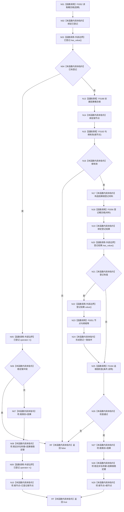

# CF-L5-0060 `概念图初始化服务::确保根<因果根创建lambda>` 现状流程图

图类型：现状流程图；代码版本：`a48a70b2d678dea64dd8228adb4f26f0badd9506`
覆盖文件：`海中鱼巣/领域/初始化.概念图.ixx:110-111,144-174,262`；唯一根函数：F0180
完整签名：`bool 海中鱼巣::概念图初始化服务::确保根<海中鱼巣::概念图初始化服务::初始化四个根()::<lambda@初始化.概念图.ixx:111>>(海中鱼巣::概念根初始化项& 项, 海中鱼巣::概念根类别 类别, std::uint64_t 稳定键, lambda@111 创建)`
参数绑定：`项=&初始化候选_.因果根`、类别=`因果`、稳定键=`因果根稳定键`、创建回调=F0188；返回结果：复用或创建并登记因果根是否成功

项目源码调用点 6 个；外部边界为 `optional` 访问和回调对象生命周期；未解析调用 0。F0180 是四根短路链第四项，失败时前三根可能已创建或登记，本函数和外层均不回滚。
