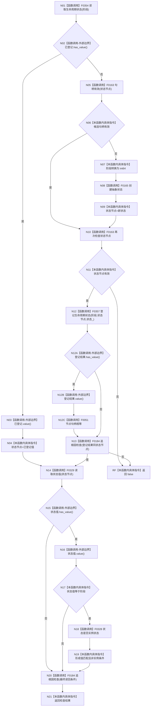

# CF-L5-0061 `概念图初始化服务::确保生命周期状态` 现状流程图

图类型：现状流程图；代码版本：`a48a70b2d678dea64dd8228adb4f26f0badd9506`
覆盖文件：`海中鱼巣/领域/初始化.概念图.ixx:186-210`；唯一根函数：F0181
完整签名：`bool 海中鱼巣::概念图初始化服务::确保生命周期状态(海中鱼巣::节点句柄& 状态节点, 海中鱼巣::概念生命周期阶段 阶段)`
参数：`状态节点` 为可写输入/输出引用，`阶段` 按值；返回结果：复用或登记的状态是否读回为指定抽象阶段

项目源码调用点 10 个、唯一项目函数 8 个；`optional` 访问为外部边界；未解析调用 0。创建或登记后的失败路径不撤销状态节点或登记。
