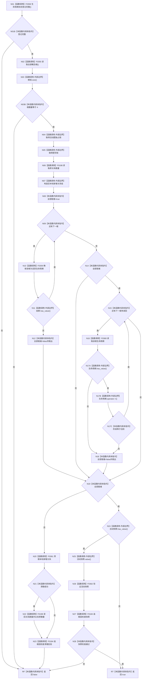

# CF-L5-0062 `概念图服务::初始化活动概念生命周期` 现状流程图

图类型：现状流程图；代码版本：`a48a70b2d678dea64dd8228adb4f26f0badd9506`
覆盖文件：`海中鱼巣/领域/概念图服务.h:981-1028`；唯一根函数：F0182
完整签名：`bool 海中鱼巣::概念图服务::初始化活动概念生命周期()`
参数：无；可写 `this`；返回结果：四个登记根是否均确保并读回为活跃生命周期，且已有活动快照（若存在）是否有效

项目源码静态调用点 10 个、唯一项目函数 8 个；锁、容器、optional 和 RAII 析构为外部边界；未解析调用 0。异常路径只释放锁，不保证调用关系清理。
