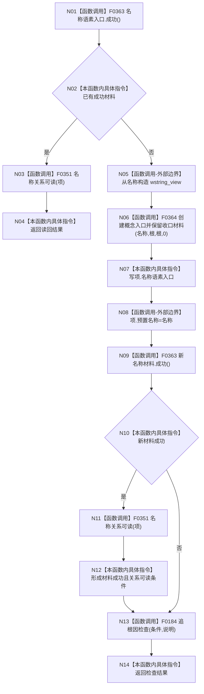

# CF-L5-0063 `概念图初始化服务::确保根名称` 现状流程图

图类型：现状流程图；代码版本：`a48a70b2d678dea64dd8228adb4f26f0badd9506`
覆盖文件：`海中鱼巣/领域/初始化.概念图.ixx:176-184`；唯一根函数：F0183
完整签名：`bool 海中鱼巣::概念图初始化服务::确保根名称(海中鱼巣::概念根初始化项& 项, const wchar_t* 名称)`
参数：可写借用 `项`，借用 NUL 结尾宽字符串 `名称`；返回结果：复用或创建的名称入口关系是否可读

项目源码调用点 6 个、唯一项目函数 4 个；字符串视图/字符串赋值和结果赋值为外部边界；未解析调用 0。复用路径完全不读取新传入的 `名称`。
