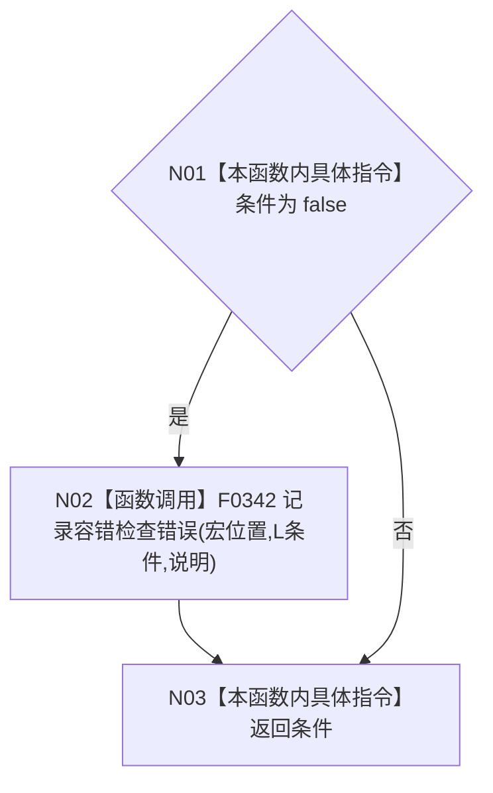
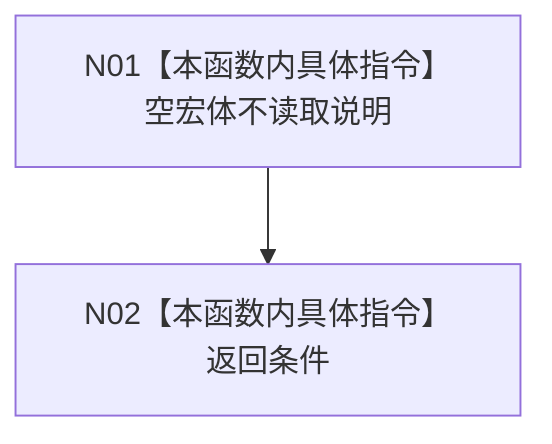

# CF-L5-0064 `追根因检查` 现状流程图

图类型：现状流程图；代码版本：`a48a70b2d678dea64dd8228adb4f26f0badd9506`
覆盖文件：`海中鱼巣/核心/容错检查.h:4-58`；唯一根函数：F0184
完整签名：`inline bool 海中鱼巣::追根因检查(bool 条件, const wchar_t* 说明)`
参数：`条件` 按值、`说明` 为同步借用指针；返回结果：正常返回时严格等于输入条件

开启 `HY_EGO_ENABLE_FAULT_TOLERANCE_CHECK` 的编译变体：

关闭 `HY_EGO_ENABLE_FAULT_TOLERANCE_CHECK` 的编译变体：

项目源码调用点 1 个，仅宏开启且条件为假时到达；直接外部边界 0，未解析调用 0。函数实参在进入 F0184 前已完成求值，宏关闭不能阻止调用方条件或说明表达式求值。
