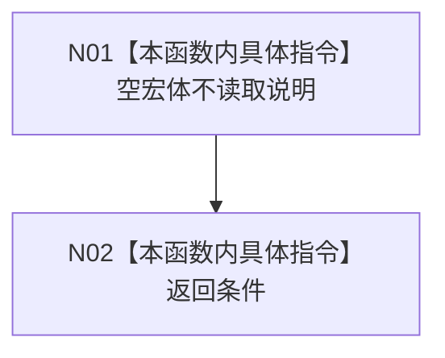

# CF-L5-0064 `追根因检查` 现状流程图

图类型：现状流程图；代码版本：`a48a70b2d678dea64dd8228adb4f26f0badd9506`
覆盖文件：`海中鱼巣/核心/容错检查.h:4-58`；唯一根函数：F0184
完整签名：`inline bool 海中鱼巣::追根因检查(bool 条件, const wchar_t* 说明)`
参数：`条件` 按值、`说明` 为同步借用指针；返回结果：正常返回时严格等于输入条件

当前正式工程全部配置均未定义 `HY_EGO_ENABLE_FAULT_TOLERANCE_CHECK`，因此唯一当前可达编译变体为：

项目被调函数 0，直接外部边界 0，未解析调用 0。函数实参在进入 F0184 前已完成求值，宏关闭不能阻止调用方条件或说明表达式求值；但 F0184 内部宏不读取 `说明`，也不存在到 F0342 的当前调用边。宏开启变体只作为反事实源码候选，不进入当前可达函数图谱。

本批新增调用方：[F0335 状态服务创建状态节点](../L6/CF-L6-0015_状态服务创建状态节点_现状流程图.md) 在状态值写入后以 E1688 调用一次，并在具名发生时间存在且时间戳写入后以 E1690 再调用一次；两条边均不以写入结果为调用条件，写入真假都进入 F0184。
