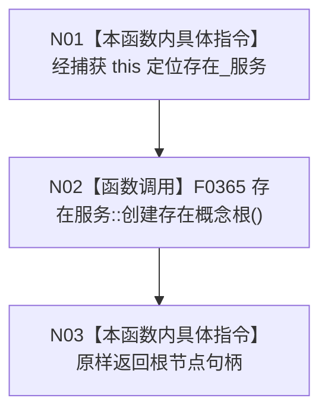

# CF-L5-0065 `初始化四个根::<lambda@105>::operator()` 现状流程图

图类型：现状流程图；代码版本：`a48a70b2d678dea64dd8228adb4f26f0badd9506`
覆盖文件：`海中鱼巣/领域/初始化.概念图.ixx:104-105,145-161`；唯一根函数：F0185
完整签名：`海中鱼巣::节点句柄 海中鱼巣::概念图初始化服务::初始化四个根()::<lambda@初始化.概念图.ixx:105>::operator()() const`
参数：无；按值捕获初始化服务裸 `this` 指针；返回结果：存在服务创建的根节点句柄

项目源码调用点 1 个；外部边界 0，未解析调用 0。仅当 F0177 未读到已登记存在根时同步调用；句柄验证、类别/固定键登记和失败清理由 F0177 之后的路径承担。
