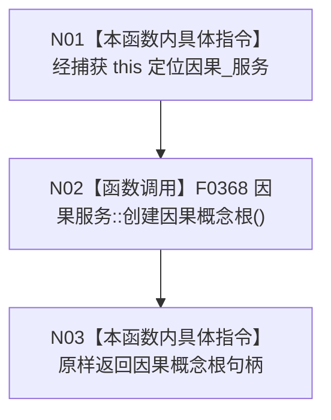

# CF-L5-0068 `初始化四个根::<lambda@111>::operator()` 现状流程图

图类型：现状流程图；代码版本：`a48a70b2d678dea64dd8228adb4f26f0badd9506`
覆盖文件：`海中鱼巣/领域/初始化.概念图.ixx:110-111,262`；唯一根函数：F0188
完整签名：`海中鱼巣::节点句柄 海中鱼巣::概念图初始化服务::初始化四个根()::<lambda@初始化.概念图.ixx:111>::operator()() const`
参数：无；按值捕获初始化服务裸 `this`；返回结果：因果服务创建的因果概念根句柄

项目源码调用点 1 个；外部边界 0，未解析调用 0。仅在前三根均确保且 F0180 未读到因果根登记时同步调用；本函数不验证返回节点类型为因果引用。
