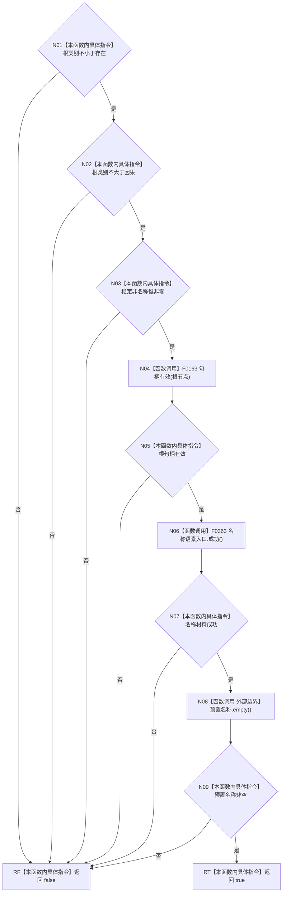

# CF-L5-0069 `概念根初始化项::成功` 现状流程图

图类型：现状流程图；代码版本：`a48a70b2d678dea64dd8228adb4f26f0badd9506`
覆盖文件：`海中鱼巣/领域/初始化.概念图.ixx:23-37`；唯一根函数：F0189
完整签名：`bool 海中鱼巣::概念根初始化项::成功() const`
参数：无；只读 `this`；返回结果：类别区间、稳定键、根句柄、名称材料和预置名称的表面完整性

项目源码调用点 2 个；外部边界 1 个，未解析调用 0。所有条件严格按 `&&` 从左到右短路。
