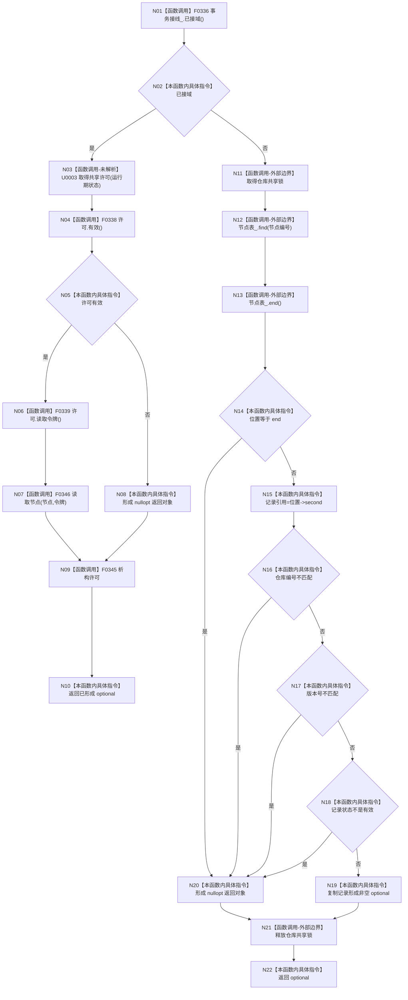

# CF-L5-0070 `节点仓库::读取节点` 现状流程图

图类型：现状流程图；代码版本：`a48a70b2d678dea64dd8228adb4f26f0badd9506`
覆盖文件：`海中鱼巣/核心/节点仓库.cpp:233-248`；唯一根函数：F0190
完整签名：`std::optional<海中鱼巣::节点记录> 海中鱼巣::节点仓库::读取节点(海中鱼巣::节点句柄 节点) const`
参数：节点句柄按值；返回结果：当前有效且身份匹配的节点记录副本，或 `nullopt`

项目源码调用点 5 个；标准库锁与哈希表操作为外部边界；运行期可替换函数指针调用 U0003 未能静态唯一解析。返回对象先形成，再析构局部许可或共享锁。

本批新增已完成调用方图：[F0333 方法服务节点类型匹配](../L6/CF-L6-0013_方法服务节点类型匹配_现状流程图.md)，对应 E1684。待处理调用方 F0357 `概念图服务::登记生命周期状态` 在源码 938 行以 E1707 无条件读取节点记录，随后 939 行才以 E1667 调用 F0329。已完成被调图：[F0336 结构事务接线已接域](../L6/CF-L6-0016_结构事务接线已接域_现状流程图.md)、[F0338 结构事务许可有效](../L6/CF-L6-0018_结构事务许可有效_现状流程图.md)、[F0339 结构事务许可读取令牌](../L6/CF-L6-0019_结构事务许可读取令牌_现状流程图.md)、[F0345 结构事务许可析构](../L6/CF-L6-0024_结构事务许可析构_现状流程图.md)、[F0346 节点仓库读取节点令牌重载](../L6/CF-L6-0025_节点仓库读取节点令牌重载_现状流程图.md)。
