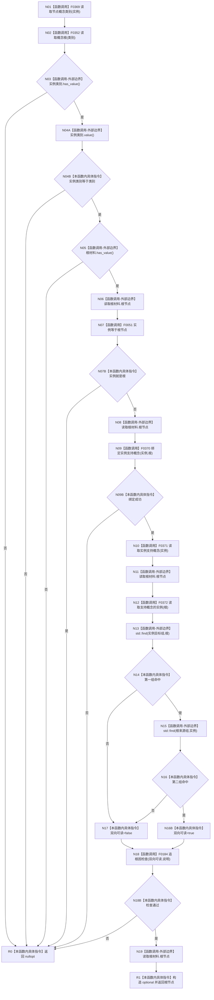

# CF-L5-0071 `概念图服务::确保实例支持对应根` 现状流程图

图类型：现状流程图；代码版本：`a48a70b2d678dea64dd8228adb4f26f0badd9506`
覆盖文件：`海中鱼巣/领域/概念图服务.h:4405-4425`；唯一根函数：F0191
完整签名：`std::optional<海中鱼巣::节点句柄> 海中鱼巣::概念图服务::确保实例支持对应根(海中鱼巣::节点句柄 实例, 海中鱼巣::概念根类别 类别)`
参数：实例句柄、根类别均按值；返回结果：双向支持关系可读时返回根句柄，否则 `nullopt`

项目源码静态调用边 9 条，其中两条是 `std::find` 对 F0051 的 0..n 次回调边；外部边界包括 optional、vector 和 `std::find`；未解析调用 0。每个 `std::find` 完整调用表达式的实参求值次序未指定，本图不虚构 `begin/end/根访问` 的内部先后。

已完成被调图双向引用：[F0352 读取概念根](../L6/CF-L6-0031_概念图服务读取概念根_现状流程图.md)。
