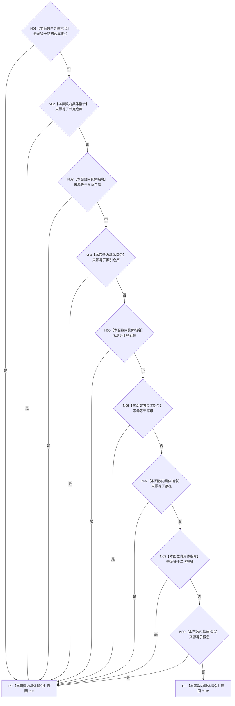

# CF-L5-0073 `统计服务::来源结构类型有效` 现状流程图

图类型：现状流程图；代码版本：`a48a70b2d678dea64dd8228adb4f26f0badd9506`
覆盖文件：`海中鱼巣/领域/统计服务.h:36-47,1004-1014`；唯一根函数：F0193
完整签名：`bool 海中鱼巣::统计服务::来源结构类型有效(海中鱼巣::来源结构类型 来源) const`
参数：枚举值按值；不读取 `this`；返回结果：是否命中九个具名来源之一

项目源码调用 0、外部边界 0、未解析调用 0；九项严格按显式白名单和 `||` 短路。
