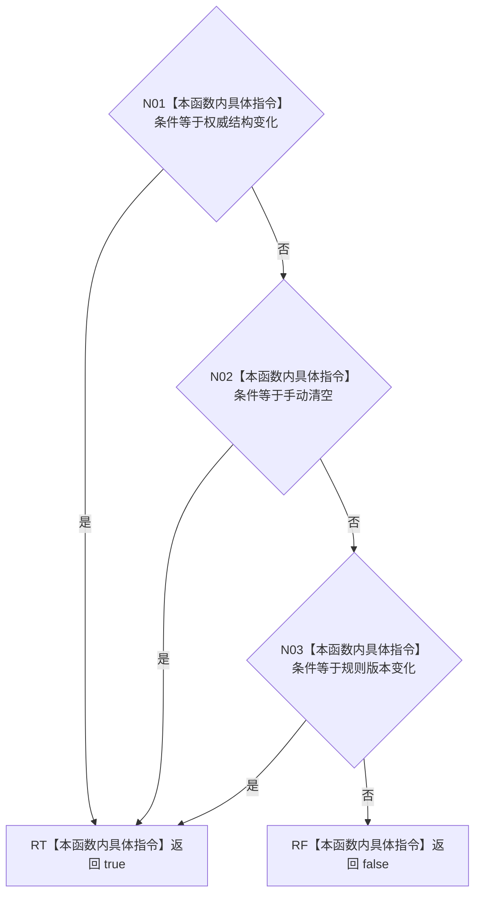

# CF-L5-0075 `统计服务::缓存失效条件有效` 现状流程图

图类型：现状流程图；代码版本：`a48a70b2d678dea64dd8228adb4f26f0badd9506`
覆盖文件：`海中鱼巣/领域/统计服务.h:61-66,1032-1036`；唯一根函数：F0195
完整签名：`bool 海中鱼巣::统计服务::缓存失效条件有效(海中鱼巣::缓存失效条件 条件) const`
参数：枚举值按值；不读取 `this`；返回结果：是否命中三个具名失效条件之一

项目源码调用 0、外部边界 0、未解析调用 0；三项严格按显式白名单和 `||` 短路。
