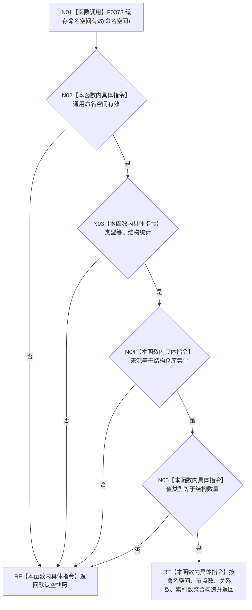

# CF-L5-0076 `统计服务::创建统计快照结构` 现状流程图

图类型：现状流程图；代码版本：`a48a70b2d678dea64dd8228adb4f26f0badd9506`
覆盖文件：`海中鱼巣/领域/统计服务.h:85-90,256-265`；唯一根函数：F0196
完整签名：`海中鱼巣::结构统计快照 海中鱼巣::统计服务::创建统计快照结构(海中鱼巣::缓存命名空间 命名空间, std::uint64_t 节点数, std::uint64_t 关系数, std::uint64_t 索引数) const`
参数：命名空间与三个计数按值；返回结果：通过专属准入后的快照值，或默认空快照

项目源码调用点 1 个；外部边界 0，未解析调用 0。函数只构造值对象，不读取仓库、不证明三个计数来自同一快照，也不发布缓存。
