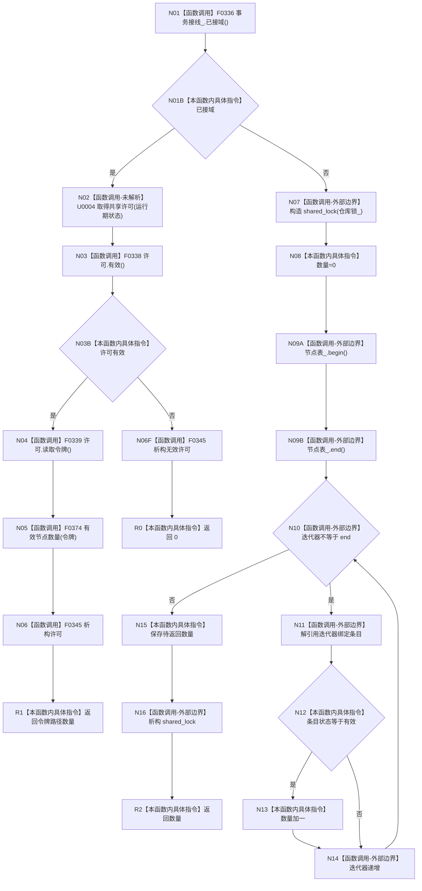

# CF-L5-0077 `节点仓库::有效节点数量` 现状流程图

图类型：现状流程图；代码版本：`a48a70b2d678dea64dd8228adb4f26f0badd9506`
覆盖文件：`海中鱼巣/核心/节点仓库.cpp:453-466`；唯一根函数：F0197
完整签名：`std::uint64_t 海中鱼巣::节点仓库::有效节点数量() const`
参数：无；返回结果：许可路径或本地共享锁扫描得到的有效记录数量

项目源码调用点 5 个；标准容器迭代和共享锁为外部边界；U0004 是运行期可替换许可函数指针，未唯一解析。许可/锁均在返回值形成后释放。

本批已完成被调图双向引用：[F0336 结构事务接线已接域](../L6/CF-L6-0016_结构事务接线已接域_现状流程图.md)、[F0338 结构事务许可有效](../L6/CF-L6-0018_结构事务许可有效_现状流程图.md)、[F0339 结构事务许可读取令牌](../L6/CF-L6-0019_结构事务许可读取令牌_现状流程图.md)。
