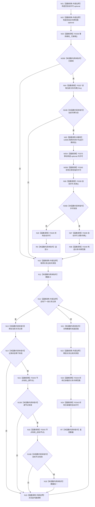

# CF-L5-0078 `关系仓库::有效关系数量` 现状流程图

图类型：现状流程图；代码版本：`a48a70b2d678dea64dd8228adb4f26f0badd9506`
覆盖文件：`海中鱼巣/核心/关系仓库.cpp:116-123,1012-1025`；唯一根函数：F0198
完整签名：`std::uint64_t 海中鱼巣::关系仓库::有效关系数量() const`
参数：无；返回结果：状态有效且源、目标节点当前均有效的关系记录数量

项目源码调用边 11 条；外部边界包括两个 optional、共享锁和关系表迭代；U0005 为运行期可替换许可函数指针。F0344/F0345 只在对应 optional 实际承载对象时调用；正常返回的释放顺序是共享锁、令牌范围、许可。

本批已完成被调图双向引用：[F0336 结构事务接线已接域](../L6/CF-L6-0016_结构事务接线已接域_现状流程图.md)、[F0337 读取当前关系令牌](../L6/CF-L6-0017_读取当前关系令牌_现状流程图.md)。
