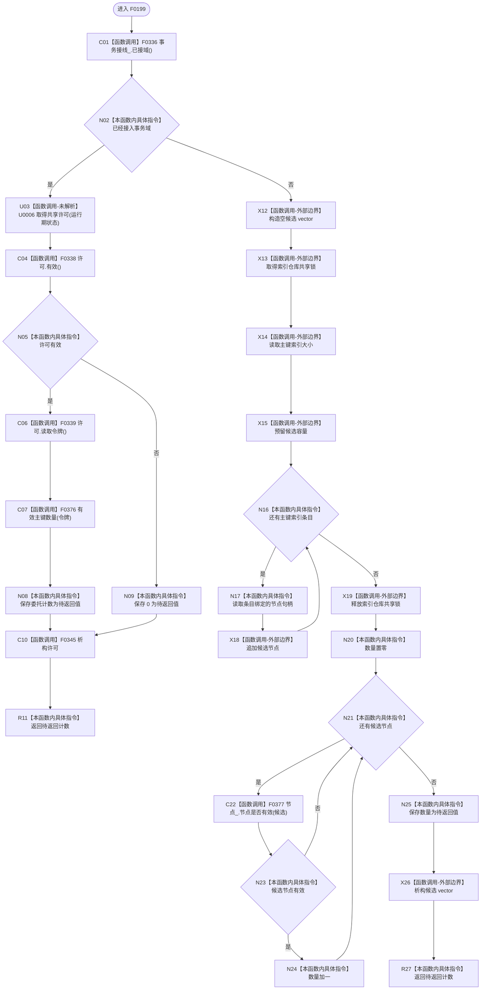

# CF-L5-0079 `索引仓库::有效主键数量` 现状流程图

图类型：现状流程图；代码版本：`a48a70b2d678dea64dd8228adb4f26f0badd9506`
覆盖文件：`海中鱼巣/核心/索引仓库.cpp:402-416`；唯一根函数：F0199
完整签名：`std::uint64_t 海中鱼巣::索引仓库::有效主键数量() const`
参数：无；返回结果：接域时委托令牌重载所得数量，未接域时索引候选中当前有效节点的数量

项目源码调用边 6 条；U0006 是运行期可替换许可函数指针；标准容器、索引迭代和共享锁均为外部边界。未接域路径先在索引锁内复制候选，解锁后再逐个查询节点仓库。
