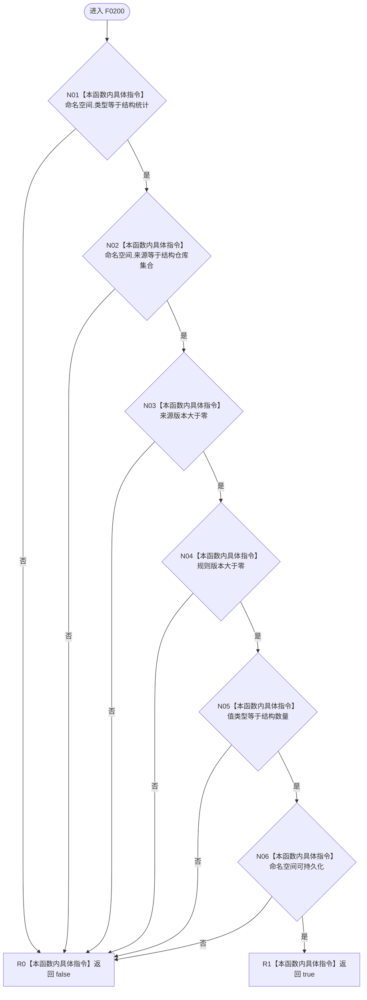

# CF-L5-0080 `快照可写入` 现状流程图

图类型：现状流程图；代码版本：`a48a70b2d678dea64dd8228adb4f26f0badd9506`
覆盖文件：`海中鱼巣/适配/SQL数据库适配.cpp:267-274`；唯一根函数：F0200
完整签名：`bool 海中鱼巣::{匿名命名空间@SQL数据库适配.cpp}::快照可写入(const 海中鱼巣::结构统计快照& 快照)`
参数：只读借用 `快照`；返回结果：六项命名空间准入条件严格左到右短路合取的布尔结果

本函数没有项目调用、外部边界或未解析调用，也不读取三个统计数量。F0055 只在本函数返回 true 后继续来源入口和数量范围检查。
