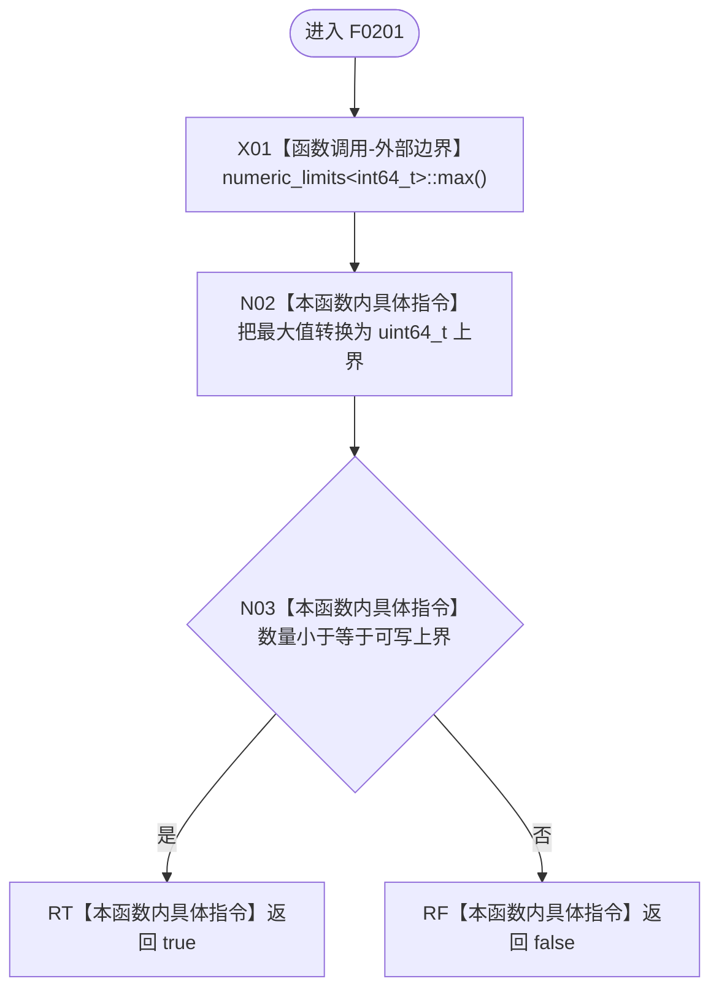

# CF-L5-0081 `数量可写入` 现状流程图

图类型：现状流程图；代码版本：`a48a70b2d678dea64dd8228adb4f26f0badd9506`
覆盖文件：`海中鱼巣/适配/SQL数据库适配.cpp:276-278`；唯一根函数：F0201
完整签名：`bool 海中鱼巣::{匿名命名空间@SQL数据库适配.cpp}::数量可写入(std::uint64_t 数量)`
参数：按值 `数量`；返回结果：数量能否无损转换到 SQL `bigint` 对应的 `int64_t` 正值域

本函数没有项目调用或未解析调用。外部边界是可被编译期折叠的标准库 `numeric_limits<int64_t>::max()`；边界值 `9223372036854775807` 允许写入，更大无符号值被拒绝。
