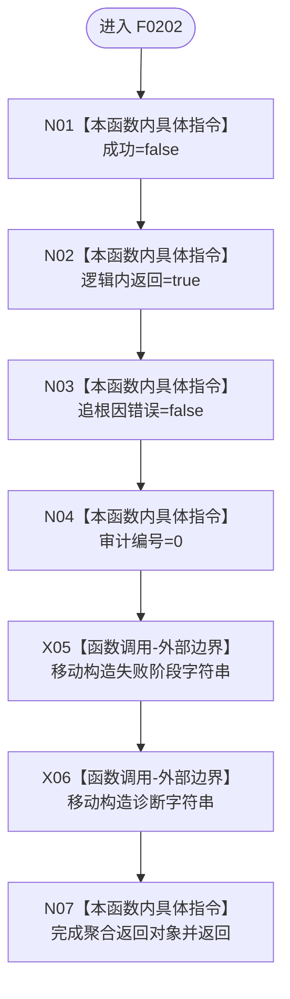

# CF-L5-0082 `逻辑内失败` 现状流程图

图类型：现状流程图；代码版本：`a48a70b2d678dea64dd8228adb4f26f0badd9506`
覆盖文件：`海中鱼巣/适配/SQL数据库适配.cpp:113-115`；唯一根函数：F0202
完整签名：`海中鱼巣::数据库操作结果 海中鱼巣::{匿名命名空间@SQL数据库适配.cpp}::逻辑内失败(std::wstring 阶段, std::wstring 诊断)`
参数：按值拥有阶段、诊断；返回结果：分类为逻辑内返回的数据库失败 DTO

本函数无项目调用或未解析调用，不记录日志、不访问数据库。两个字符串的所有权转入返回 DTO；已移动形参在退出时由标准库析构。
