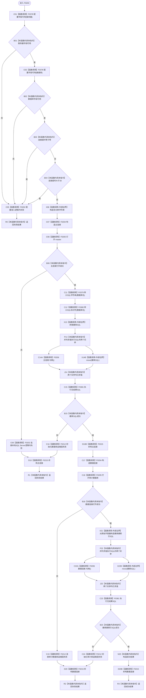

# CF-L5-0083 `SQL数据库适配::初始化数据库` 现状流程图

图类型：现状流程图；代码版本：`a48a70b2d678dea64dd8228adb4f26f0badd9506`
覆盖文件：`海中鱼巣/适配/SQL数据库适配.cpp:329-379`；唯一根函数：F0203
完整签名：`海中鱼巣::数据库操作结果 海中鱼巣::SQL数据库适配::初始化数据库() const`
参数：无，借用 `this->配置_`；返回结果：配置拒绝、连接失败、建库/建表失败或初始化成功的结构化结果

项目源码调用边 19 条；新发现 F0378—F0381。两次调用 F0381 前，句柄读取与 SQL 字符串移动属于同一调用的两个实参求值，彼此没有固定先后，图以并列汇合表示。
