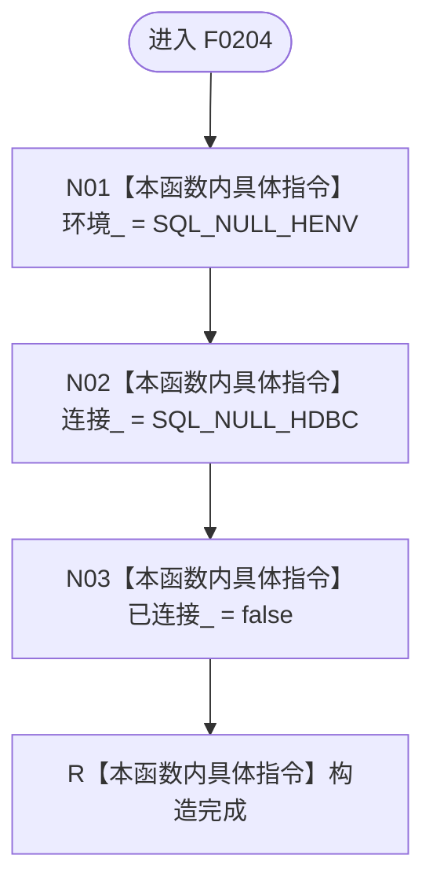

# CF-L5-0084 `ODBC连接::ODBC连接` 现状流程图

图类型：现状流程图；代码版本：`a48a70b2d678dea64dd8228adb4f26f0badd9506`
覆盖文件：`海中鱼巣/适配/SQL数据库适配.cpp:121-123,216-219`；唯一根函数：F0204
完整签名：`海中鱼巣::{匿名命名空间@SQL数据库适配.cpp}::ODBC连接::ODBC连接()`
参数：无，隐含 `this` 指向待构造存储；返回结果：构造完成的中性、未持有 ODBC 资源的对象

默认构造函数无显式正文，但三个默认成员初始化器按声明顺序执行。本函数不分配句柄、不打开数据库；两个 SQL 空句柄宏是外部常量，不是函数调用。
