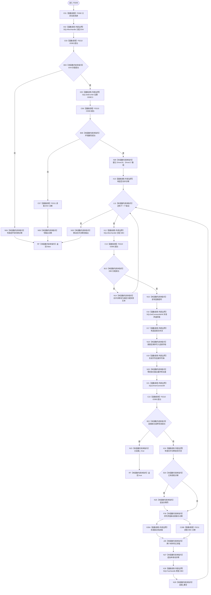

# CF-L5-0085 `ODBC连接::打开` 现状流程图

图类型：现状流程图；代码版本：`a48a70b2d678dea64dd8228adb4f26f0badd9506`
覆盖文件：`海中鱼巣/适配/SQL数据库适配.cpp:132-194`；唯一根函数：F0205
完整签名：`bool 海中鱼巣::{匿名命名空间@SQL数据库适配.cpp}::ODBC连接::打开(const 海中鱼巣::SQL数据库配置& 配置, std::wstring_view 数据库, std::wstring& 诊断)`
参数：只读配置与数据库视图、可写诊断引用；返回结果：是否建立并持有 ODBC 连接

项目源码调用边 7 条；新发现 F0382。ODBC API 和标准库流/字符串均为外部边界。成功后对象持有 ENV/DBC；失败后的残余 ENV 由以后 F0382 或析构收口。
