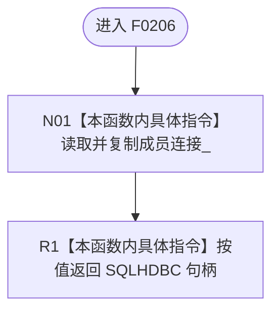

# CF-L5-0086 `ODBC连接::句柄` 现状流程图

图类型：现状流程图；代码版本：`a48a70b2d678dea64dd8228adb4f26f0badd9506`
覆盖文件：`海中鱼巣/适配/SQL数据库适配.cpp:196-198`；唯一根函数：F0206
完整签名：`SQLHDBC 海中鱼巣::{匿名命名空间@SQL数据库适配.cpp}::ODBC连接::句柄() const`
参数：无；返回结果：按值复制的 ODBC 连接句柄，不转移所有权

本函数没有项目调用、外部函数调用或未解析调用。返回类型不表达借用期；当前调用点均在拥有该句柄的 `ODBC连接` 对象存活时立即消费。
