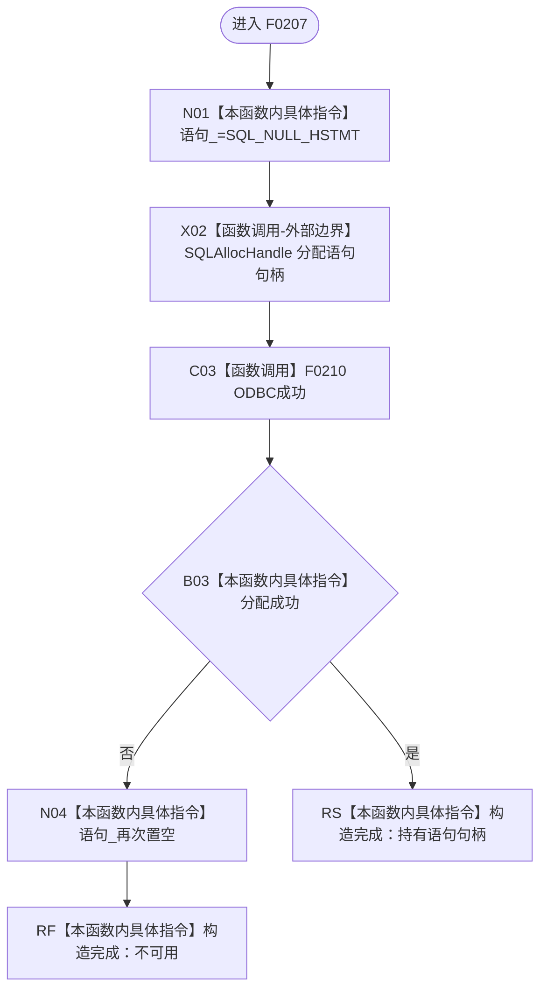

# CF-L5-0087 `ODBC语句::ODBC语句` 现状流程图

图类型：现状流程图；代码版本：`a48a70b2d678dea64dd8228adb4f26f0badd9506`
覆盖文件：`海中鱼巣/适配/SQL数据库适配.cpp:221-227,247-248`；唯一根函数：F0207
完整签名：`海中鱼巣::{匿名命名空间@SQL数据库适配.cpp}::ODBC语句::ODBC语句(SQLHDBC 连接)`
参数：按值复制连接句柄，隐含 `this`；返回结果：持有新语句句柄或保持空句柄的构造完成对象

项目源码调用边一条，外部 ODBC 边界一条，未解析调用为零。失败只编码为空句柄；调用方需用 F0208 判断可用性。
