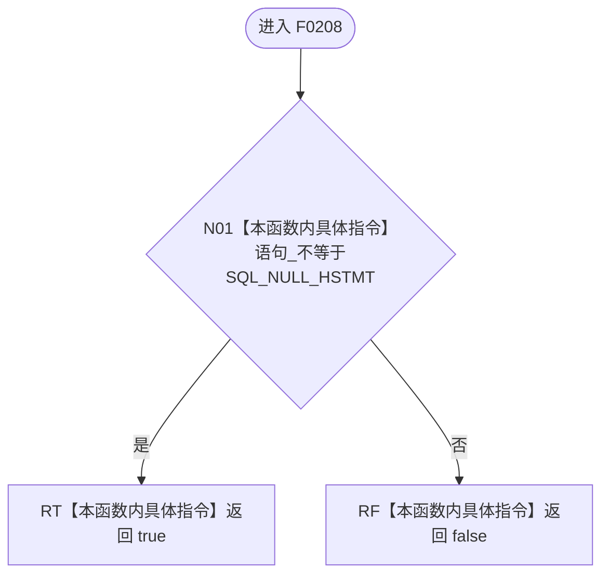

# CF-L5-0088 `ODBC语句::可用` 现状流程图

图类型：现状流程图；代码版本：`a48a70b2d678dea64dd8228adb4f26f0badd9506`
覆盖文件：`海中鱼巣/适配/SQL数据库适配.cpp:238-240`；唯一根函数：F0208
完整签名：`bool 海中鱼巣::{匿名命名空间@SQL数据库适配.cpp}::ODBC语句::可用() const`
参数：无；返回结果：语句句柄是否非空

本函数无项目调用、外部函数调用或未解析调用。true 仅证明句柄非空，不证明连接健康、语句已准备或 SQL 可执行。
