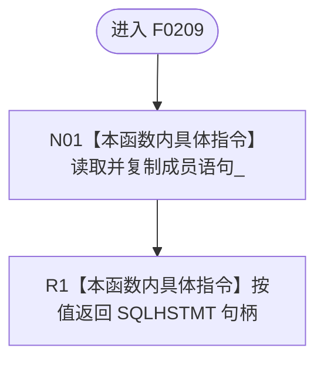

# CF-L5-0089 `ODBC语句::句柄` 现状流程图

图类型：现状流程图；代码版本：`a48a70b2d678dea64dd8228adb4f26f0badd9506`
覆盖文件：`海中鱼巣/适配/SQL数据库适配.cpp:242-244`；唯一根函数：F0209
完整签名：`SQLHSTMT 海中鱼巣::{匿名命名空间@SQL数据库适配.cpp}::ODBC语句::句柄() const`
参数：无；返回结果：按值复制的非拥有 ODBC 语句句柄

本函数无项目调用、外部函数调用或未解析调用。返回类型不表达借用期；当前调用点均在 F0214 析构前同步消费。
