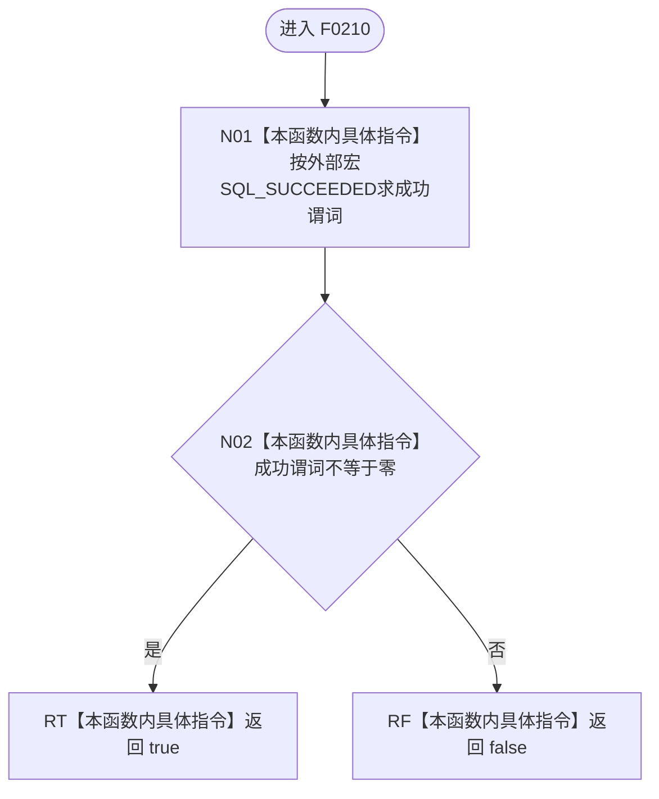

# CF-L5-0090 `ODBC成功` 现状流程图

图类型：现状流程图；代码版本：`a48a70b2d678dea64dd8228adb4f26f0badd9506`
覆盖文件：`海中鱼巣/适配/SQL数据库适配.cpp:28-30`；唯一根函数：F0210
完整签名：`bool 海中鱼巣::{匿名命名空间@SQL数据库适配.cpp}::ODBC成功(SQLRETURN 结果)`
参数：按值 ODBC 返回码；返回结果：是否为 `SQL_SUCCESS` 或 `SQL_SUCCESS_WITH_INFO`

`SQL_SUCCEEDED` 是 ODBC 头文件宏，不是运行期函数。本函数无项目调用、外部运行时函数调用或未解析调用，并会把具体成功/失败状态压缩为布尔值。
