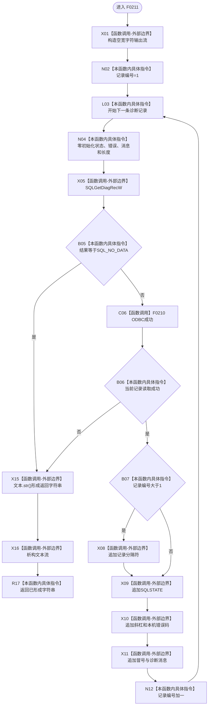

# CF-L5-0091 `读取ODBC诊断` 现状流程图

图类型：现状流程图；代码版本：`a48a70b2d678dea64dd8228adb4f26f0badd9506`
覆盖文件：`海中鱼巣/适配/SQL数据库适配.cpp:32-64`；唯一根函数：F0211
完整签名：`std::wstring 海中鱼巣::{匿名命名空间@SQL数据库适配.cpp}::读取ODBC诊断(SQLSMALLINT 句柄类型, SQLHANDLE 句柄)`
参数：按值句柄类型和借用句柄；返回结果：以分隔符拼接的 ODBC 人读诊断文本

项目源码调用边一条；ODBC 读取和标准流/数组操作为外部边界。空字符串会同时表示无记录和首条读取失败；部分记录成功后失败则返回无失败标志的部分文本。
