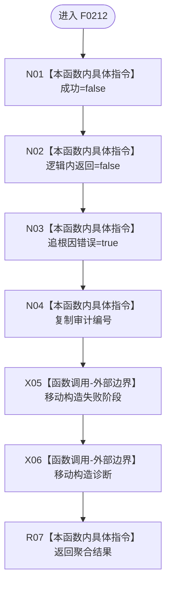

# CF-L5-0092 `追根因失败` 现状流程图

图类型：现状流程图；代码版本：`a48a70b2d678dea64dd8228adb4f26f0badd9506`
覆盖文件：`海中鱼巣/适配/SQL数据库适配.cpp:117-119`；唯一根函数：F0212
完整签名：`海中鱼巣::数据库操作结果 海中鱼巣::{匿名命名空间@SQL数据库适配.cpp}::追根因失败(std::wstring 阶段, std::wstring 诊断, std::uint64_t 审计编号 = 0)`
参数：按值阶段、诊断和审计编号；返回结果：分类为追根因错误的数据库失败 DTO

本函数无项目调用或未解析调用。它保证自身产出的三个状态布尔互斥，但阶段和诊断仍是非权威人读文本。
