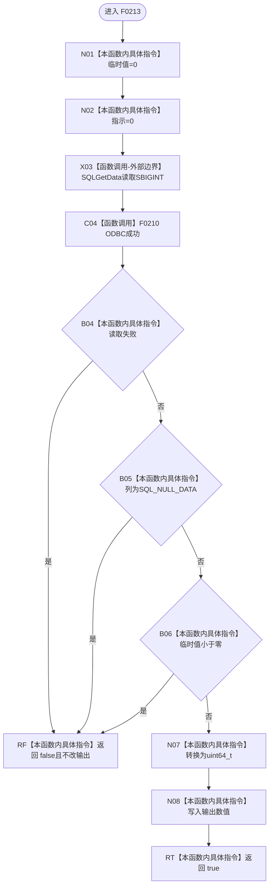

# CF-L5-0093 `读取整数列` 现状流程图

图类型：现状流程图；代码版本：`a48a70b2d678dea64dd8228adb4f26f0badd9506`
覆盖文件：`海中鱼巣/适配/SQL数据库适配.cpp:297-306`；唯一根函数：F0213
完整签名：`bool 海中鱼巣::{匿名命名空间@SQL数据库适配.cpp}::读取整数列(SQLHSTMT 语句, SQLUSMALLINT 列号, std::uint64_t& 数值)`
参数：按值语句句柄和列号、可写数值引用；返回结果：成功读取非 NULL、非负 bigint 时写输出并返回 true

项目源码调用边一条，ODBC 外部边界一项，未解析调用为零。失败路径始终在写输出引用前返回，因此不会留下半更新结果。
