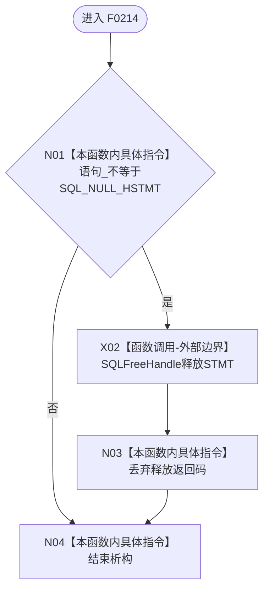

# CF-L5-0094 `ODBC语句::~ODBC语句` 现状流程图

图类型：现状流程图；代码版本：`a48a70b2d678dea64dd8228adb4f26f0badd9506`
覆盖文件：`海中鱼巣/适配/SQL数据库适配.cpp:229-233`；唯一根函数：F0214
完整签名：`海中鱼巣::{匿名命名空间@SQL数据库适配.cpp}::ODBC语句::~ODBC语句()`
参数：无，隐含 `this` 指向待析构对象；返回结果：无

本函数无项目调用或未解析调用。析构在非空句柄路径尝试释放一次，但丢弃 ODBC 返回码，因此析构完成不能作为释放成功证据。
