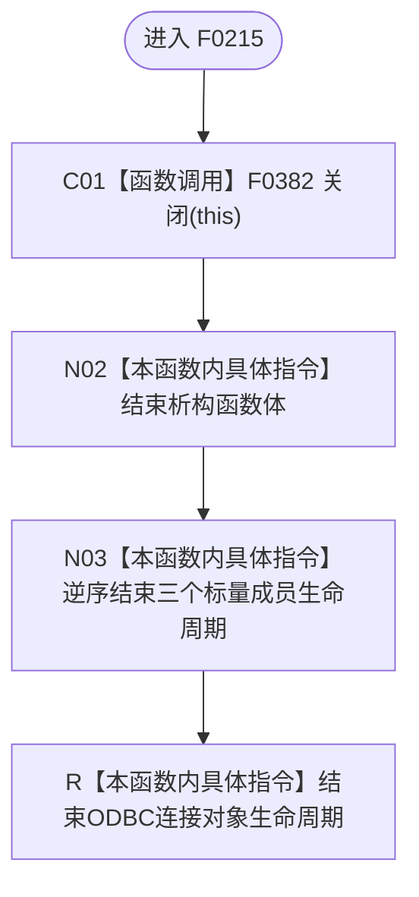

# CF-L5-0095 `ODBC连接::~ODBC连接` 现状流程图

图类型：现状流程图；代码版本：`a48a70b2d678dea64dd8228adb4f26f0badd9506`
覆盖文件：`海中鱼巣/适配/SQL数据库适配.cpp:125-127,216-219`；唯一根函数：F0215
完整签名：`海中鱼巣::{匿名命名空间@SQL数据库适配.cpp}::ODBC连接::~ODBC连接()`
参数：无，隐含 `this` 指向待析构对象；返回结果：无

本函数自身不直接调用 ODBC API；全部断开、释放和成员复位属于 F0382。项目源码调用边一条，外部函数调用和未解析调用均为零。
