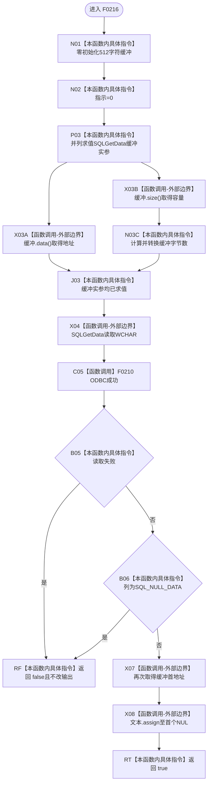

# CF-L5-0096 `读取文本列` 现状流程图

图类型：现状流程图；代码版本：`a48a70b2d678dea64dd8228adb4f26f0badd9506`
覆盖文件：`海中鱼巣/适配/SQL数据库适配.cpp:280-295`；唯一根函数：F0216
完整签名：`bool 海中鱼巣::{匿名命名空间@SQL数据库适配.cpp}::读取文本列(SQLHSTMT 语句, SQLUSMALLINT 列号, std::wstring& 文本)`
参数：按值语句句柄和列号、可写文本引用；返回结果：成功读取非 NULL 文本时提交输出并返回 true

项目源码调用边一条，未解析调用为零。当前两个调用列均小于缓冲容量；通用 helper 不检查 ODBC 指示长度，未来长文本可能以 `SQL_SUCCESS_WITH_INFO` 被当作成功并发布截断内容。
