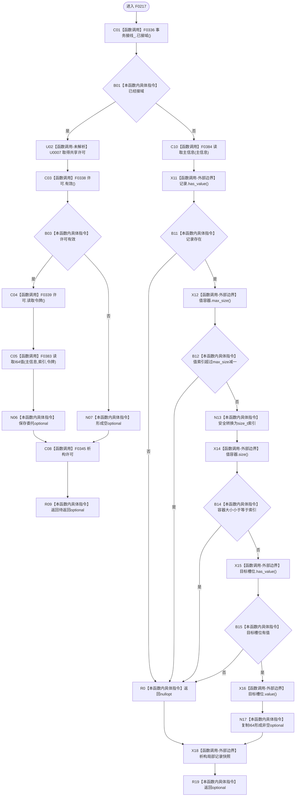

# CF-L5-0097 `主信息仓库::读取I64值` 索引重载现状流程图

图类型：现状流程图；代码版本：`a48a70b2d678dea64dd8228adb4f26f0badd9506`
覆盖文件：`海中鱼巣/核心/主信息仓库.cpp:430-444`；唯一根函数：F0217
完整签名：`std::optional<std::int64_t> 海中鱼巣::主信息仓库::读取I64值(海中鱼巣::主信息句柄 主信息, std::uint64_t 值索引) const`
参数：按值主信息句柄和值索引；返回结果：目标槽位的 I64 副本或空 optional

项目源码调用边 6 条；U0007 是运行期可替换许可函数指针。未接域路径读取完整记录快照后访问单个槽位，所有拒绝原因均折叠为空 optional。

本批已完成被调图双向引用：[F0336 结构事务接线已接域](../L6/CF-L6-0016_结构事务接线已接域_现状流程图.md)、[F0338 结构事务许可有效](../L6/CF-L6-0018_结构事务许可有效_现状流程图.md)、[F0339 结构事务许可读取令牌](../L6/CF-L6-0019_结构事务许可读取令牌_现状流程图.md)。
