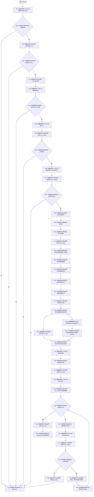

# CF-L5-0098 `生成控制面板世界树节点材料` 现状流程图

图类型：现状流程图；代码版本：`a48a70b2d678dea64dd8228adb4f26f0badd9506`
覆盖文件：`海中鱼巣/界面/投影.控制面板启动.ixx:70-126`；唯一根函数：F0218
完整签名：`std::optional<海中鱼巣::控制面板树节点材料> 海中鱼巣::生成控制面板世界树节点材料(const 海中鱼巣::节点仓库& 节点, const 海中鱼巣::关系仓库& 关系, 海中鱼巣::节点句柄 当前节点, const 海中鱼巣::世界树初始化结果& 初始化结果, const 海中鱼巣::语素初始化结果& 语素初始化读数, const std::optional<海中鱼巣::世界树相对坐标>& 自我相对坐标, std::vector<海中鱼巣::节点句柄>& 当前父链)`
返回结果：完整递归子树材料或空 optional

项目源码调用边 8 条，含递归回边；新发现 F0385—F0387。排序 lambda 只有单个内建编号比较，作为 `std::sort` 回调边界记录，不单独扩图。
