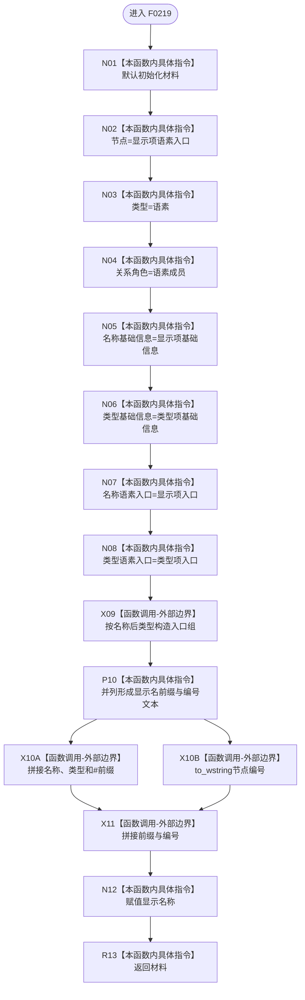

# CF-L5-0099 `生成语素树显示节点材料` 现状流程图

图类型：现状流程图；代码版本：`a48a70b2d678dea64dd8228adb4f26f0badd9506`
覆盖文件：`海中鱼巣/界面/投影.控制面板启动.ixx:154-169`；唯一根函数：F0219
完整签名：`海中鱼巣::控制面板树节点材料 海中鱼巣::生成语素树显示节点材料(const 海中鱼巣::语素初始化显示项& 显示项, const 海中鱼巣::语素初始化显示项& 类型项)`
返回结果：值式语素树显示节点材料

本函数没有项目调用或未解析调用。根调用会把同一语素类型项同时作为名称与类型来源，因此两个入口和两段显示文本均可重复，这是当前代码事实。
