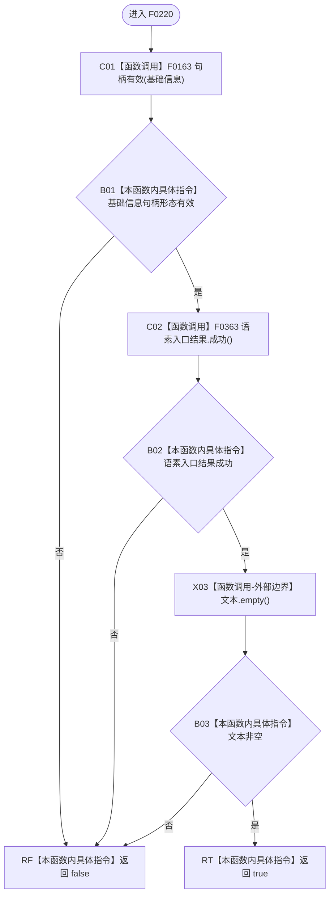

# CF-L5-0100 `语素初始化显示项::成功` 现状流程图

图类型：现状流程图；代码版本：`a48a70b2d678dea64dd8228adb4f26f0badd9506`
覆盖文件：`海中鱼巣/领域/初始化.语素.ixx:24-28`；唯一根函数：F0220
完整签名：`bool 海中鱼巣::语素初始化显示项::成功() const`
参数：无；返回结果：基础信息句柄、语素入口结果和显示文本最低形态的短路合取

项目源码调用边两条；未解析调用为零。成功仅证明显示项最低形态，不证明句柄当前存在、关系一致、主键已绑定或 UI 已显示。
