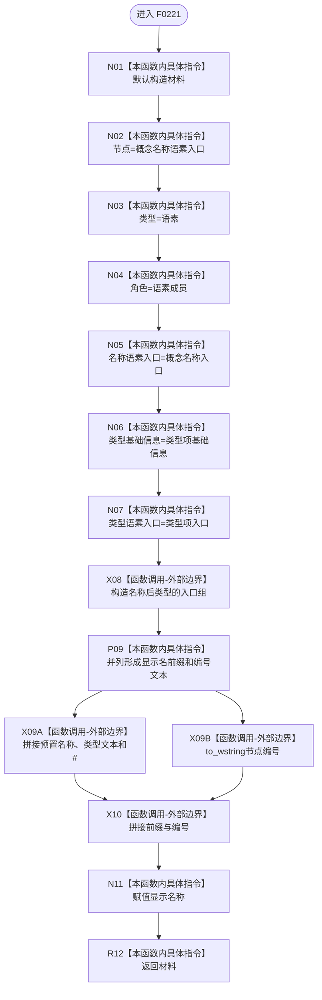

# CF-L5-0101 `生成概念名称语素树显示节点材料` 现状流程图

图类型：现状流程图；代码版本：`a48a70b2d678dea64dd8228adb4f26f0badd9506`
覆盖文件：`海中鱼巣/界面/投影.控制面板启动.ixx:171-185`；唯一根函数：F0221
完整签名：`海中鱼巣::控制面板树节点材料 海中鱼巣::生成概念名称语素树显示节点材料(const 海中鱼巣::概念根初始化项& 概念根, const 海中鱼巣::语素初始化显示项& 类型项)`
返回结果：概念名称语素对应的只读叶节点材料

本函数没有项目调用或未解析调用，也不自行调用输入成功门禁。`名称基础信息` 保持默认空句柄，真实节点身份由名称语素入口句柄承载。
