# CF-L5-0102 `控制面板窗口::窗口实现::窗口实现` 现状流程图

图类型：现状流程图；代码版本：`a48a70b2d678dea64dd8228adb4f26f0badd9506`
覆盖文件：`海中鱼巣/界面/控制面板窗口.cpp:258-307`；唯一根函数：F0222
完整签名：`海中鱼巣::控制面板窗口::窗口实现::窗口实现(const 海中鱼巣::控制面板服务& 面板服务, const 海中鱼巣::SQL数据库适配& 数据库适配, 海中鱼巣::结构统计快照 启动结构统计)`
返回结果：尚未创建或显示 Win32 窗口的中性 PImpl 对象

```mermaid
flowchart TD
 S([进入 F0222]) --> N01["N01【本函数内具体指令】绑定控制面板const引用"] --> N02["N02【本函数内具体指令】绑定数据库const引用"] --> N03["N03【本函数内具体指令】默认初始化当前快照"] --> N04["N04【本函数内具体指令】停止请求=nullptr"]
 N04 --> N05["N05【本函数内具体指令】主窗口=nullptr"] --> N06["N06【本函数内具体指令】标题文本=nullptr"] --> N07["N07【本函数内具体指令】边界文本=nullptr"] --> N08["N08【本函数内具体指令】导航栏=nullptr"] --> N09["N09【本函数内具体指令】树视图=nullptr"] --> N10["N10【本函数内具体指令】概念根下拉=nullptr"] --> N11["N11【本函数内具体指令】上一根页按钮=nullptr"] --> N12["N12【本函数内具体指令】下一根页按钮=nullptr"] --> N13["N13【本函数内具体指令】节点数文本=nullptr"] --> N14["N14【本函数内具体指令】关系数文本=nullptr"] --> N15["N15【本函数内具体指令】索引数文本=nullptr"] --> N16["N16【本函数内具体指令】详情文本=nullptr"] --> N17["N17【本函数内具体指令】数据库标题文本=nullptr"] --> N18["N18【本函数内具体指令】数据库列表=nullptr"] --> N19["N19【本函数内具体指令】刷新按钮=nullptr"] --> N20["N20【本函数内具体指令】操作请求按钮=nullptr"] --> N21["N21【本函数内具体指令】关闭按钮=nullptr"] --> N22["N22【本函数内具体指令】状态栏=nullptr"] --> N23["N23【本函数内具体指令】菜单栏=nullptr"] --> N24["N24【本函数内具体指令】快捷键表=nullptr"] --> N25["N25【本函数内具体指令】正文字体=nullptr"] --> N26["N26【本函数内具体指令】标题字体=nullptr"]
 N26 --> N27["N27【本函数内具体指令】当前分页=信息树"] --> N28["N28【本函数内具体指令】当前分类索引=0"] --> N29["N29【本函数内具体指令】当前日志信息索引=0"] --> N30["N30【本函数内具体指令】当前系统信息索引=0"] --> N31["N31【本函数内具体指令】当前树项引用序号=0"] --> N32["N32【本函数内具体指令】树项引用组为空"] --> N33["N33【本函数内具体指令】当前分类树根项=nullptr"] --> X34["X34【函数调用-外部边界】根页历史组={nullopt}"] --> N35["N35【本函数内具体指令】已显示窗口=false"] --> N36["N36【本函数内具体指令】追根因错误=false"] --> N37["N37【本函数内具体指令】最近按需候选已替换=false"] --> N38["N38【本函数内具体指令】最近逻辑拒绝状态=可展示"] --> N39["N39【本函数内具体指令】正在重建树视图=false"] --> N40["N40【本函数内具体指令】窗口类由本次注册=false"] --> X41["X41【函数调用-外部边界】失败阶段=空字符串"] --> N42["N42【本函数内具体指令】复制启动统计到当前快照"] --> R["R【本函数内具体指令】构造完成"]
```

成员严格按声明顺序初始化。本函数没有项目、Win32、数据库或未解析调用；构造完成不代表窗口类已注册、窗口已创建或候选已验证。
