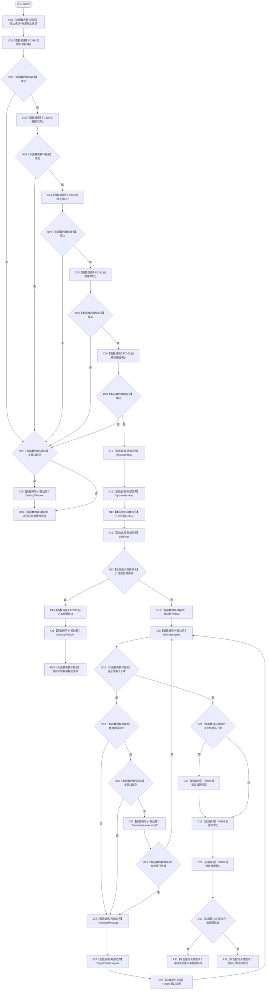

# CF-L5-0103 `控制面板窗口::窗口实现::运行` 现状流程图

图类型：现状流程图；代码版本：`a48a70b2d678dea64dd8228adb4f26f0badd9506`
覆盖文件：`海中鱼巣/界面/控制面板窗口.cpp:1551-1593`；唯一根函数：F0223
完整签名：`海中鱼巣::控制面板窗口运行结果 海中鱼巣::控制面板窗口::窗口实现::运行(const volatile std::sig_atomic_t* 外部停止请求)`
参数：无所有权可空停止标志指针；返回结果：启动失败、计时器失败、消息循环失败或正常关闭的结构化结果

项目源码调用边 10 条，含 Win32 消息调度到 F0396 的已知回调边；外部 Win32 API 不生成项目流程图。`已显示窗口=true` 仅是调用后的本地状态，不证明 ShowWindow/UpdateWindow 实际成功。
