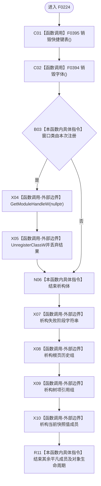

# CF-L5-0104 `控制面板窗口::窗口实现::~窗口实现` 现状流程图

图类型：现状流程图；代码版本：`a48a70b2d678dea64dd8228adb4f26f0badd9506`
覆盖文件：`海中鱼巣/界面/控制面板窗口.cpp:309-315,258-301`；唯一根函数：F0224
完整签名：`海中鱼巣::控制面板窗口::窗口实现::~窗口实现()`
参数：无；返回结果：无

项目源码调用边两条、Win32 外部调用两条、未解析调用零。析构不直接销毁主窗口；完整资源闭合依赖运行路径及 Win32 父子资源语义。
