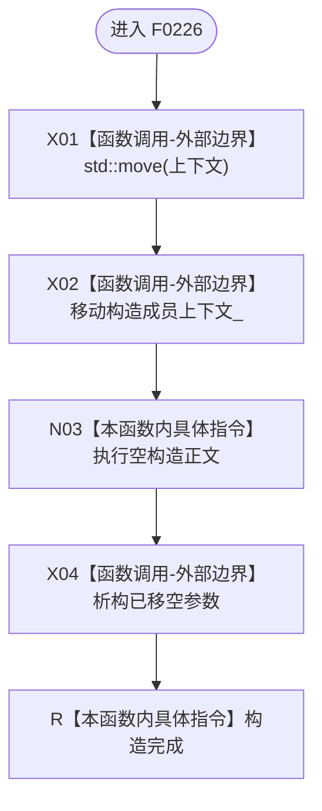

# CF-L5-0105 `运行期上下文租约::运行期上下文租约` 现状流程图

图类型：现状流程图；代码版本：`a48a70b2d678dea64dd8228adb4f26f0badd9506`
覆盖文件：`海中鱼巣/启动.运行期上下文.ixx:192-203`；唯一根函数：F0226
完整签名：`海中鱼巣::运行期上下文租约::运行期上下文租约(std::shared_ptr<const 海中鱼巣::运行期上下文> 上下文)`
参数：按值只读 shared_ptr；返回结果：共享同一上下文身份的租约对象

本函数无项目、系统或未解析调用。shared_ptr 移动保持同一控制块与上下文身份，不深拷贝对象，也不增加强引用总数。
