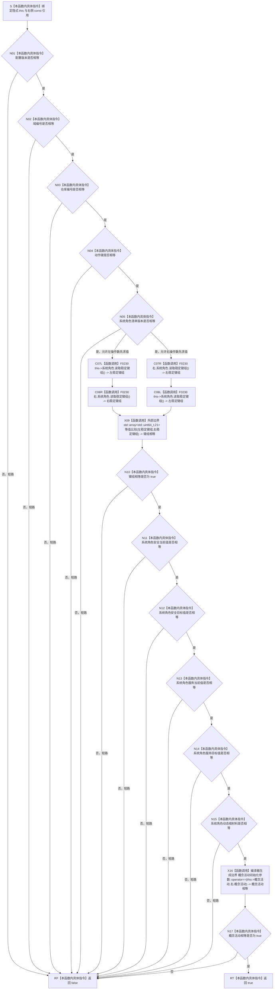

# CF-L5-0106 `生产运行期配置::operator==` 现状流程图

图类型：现状流程图
代码版本：`a48a70b2d678dea64dd8228adb4f26f0badd9506`
覆盖文件：`海中鱼巣/生产运行期配置.数据.h:64-75`
唯一根函数：F0227
完整签名：`bool 海中鱼巣::生产运行期配置::operator==(const 海中鱼巣::生产运行期配置& 右) const noexcept`
参数：隐式 `this` 为当前配置的只读借用；`右` 为另一配置的只读借用，二者均不转移所有权且须在调用期间有效
返回结果：依次比较全部配置字段；全部相等时返回 `true`，首个不等时因 `&&` 短路返回 `false`
调用图：`流程图/代码流程图/00_调用知识图谱.md` 与 `00_调用知识图谱.json`（本批次由顶层任务统一登记）
逐行映射表：`流程图/代码流程图/L5/CF-L5-0106_生产运行期配置等值比较_逐行代码映射表.md`
输入契约 / 调用语境表：当前图冻结 const 引用、只读比较与短路代码事实；按 `0600` 第 9 节核规后，字段全集等值合同的正式依据仍不足
非成功返回二分审查表：本函数只产生值对象等值布尔结果，不写机器事实；`false` 表示两配置不等，不冒充业务拒绝或内部错误
偏差清单：`流程图/代码流程图/00_规范偏差审计.md` 的 F0227 逐函数逐节点记录
依据提交 / 结构化消息：冻结代码提交 `a48a70b2d678dea64dd8228adb4f26f0badd9506`；F0227 独占切片任务
验证输出：待顶层任务统一执行图谱端点、Markdown、严格规范检查与 Git 差异检查
不得作为施工许可：是
不得宣称：不得据此宣称符合新规范、代码已修改、构建或运行已经验证、图谱已经闭合



## 节点合同

| 节点 | 类型 | 参数 / 输入绑定 | 结果 / 输出绑定 | 事实读写 | 后继条件 | 验证 |
| --- | --- | --- | --- | --- | --- | --- |
| N01-N05 | 本函数内具体指令 | `this` 与 `右` 的对应标量字段 | 对应字段是否相等 | 只读字段；无结构变化 | 相等则继续，不等则短路到 RF | 对照 65-67 行 |
| C07L / C08L | 函数调用 | `this=&this->系统角色` | `左稳定键组` | 只读系统角色参数 | 调用完成后求值另一操作数或比较 | F0230；同一源码调用点的两种顺序表示 |
| C07R / C08R | 函数调用 | `this=&右.系统角色` | `右稳定键组` | 只读右侧系统角色参数 | 调用完成后求值另一操作数或比较 | F0230；同一源码调用点的两种顺序表示 |
| X09 | 函数调用 | 左、右 `std::array<std::uint64_t,21>` 临时值 | `键组相等` | 只读临时值 | 调用完成进入 N10 | 标准库外部边界，不生成项目图 |
| N10-N15 | 本函数内具体指令 | 键组比较结果及对应标量字段 | 当前比较是否相等 | 只读；无结构变化 | 相等则继续，不等则短路到 RF | 对照 68-73 行 |
| X16 | 函数调用 | `this->概念活动`、`右.概念活动` | `概念活动相等` | 只读两侧聚合值 | 调用完成进入 N17 | `概念活动初始化参数::operator==` 在项目中仅 `= default` 声明，函数体由编译器生成 |
| N17 | 本函数内具体指令 | `概念活动相等` | 最终布尔分支 | 无 | false 到 RF；true 到 RT | 对照 74 行 |
| RF | 本函数内具体指令 | 首个不相等的短路结果 | `false` | 无 | 函数返回 | 覆盖任一比较失败 |
| RT | 本函数内具体指令 | 全部比较均相等 | `true` | 无 | 函数返回 | 覆盖全部比较成功 |

## 关键边界

```text
1. 12 个 && 操作数按源码从左到右求值，首个 false 后后续字段与调用均不再求值。
2. 第 68 行整个数组等值表达式仅在前五项比较均为 true 时执行。
3. 第 68 行左、右两个 F0230 调用各执行一次；== 两操作数之间的求值先后未被源码固定，图中两条路径表达这一代码事实。
4. F0230 是项目源码函数，两个调用点分别绑定 this->系统角色与右.系统角色；被调图由待展开队列另行生成并双向登记。
5. std::array 等值比较和 = default 的概念活动等值函数没有项目源码函数体，均只登记外部边界，不生成本批项目函数图。
6. 本函数不写机器结构、不记录日志、不产生半结构；字段全集是否就是正式配置身份合同目前登记为“证据不足”。
```
