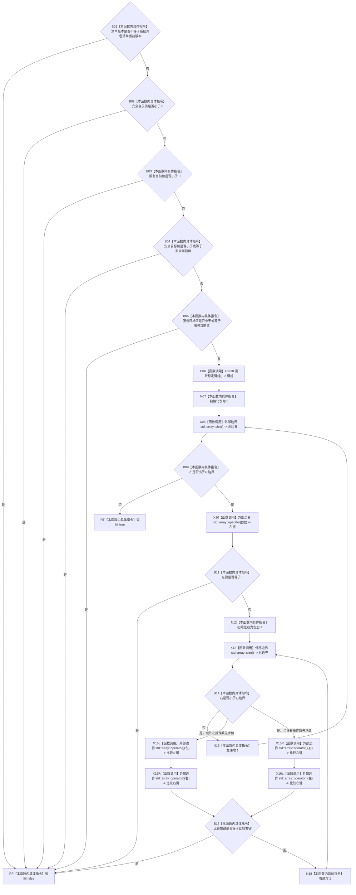

# CF-L5-0107 `系统角色初始化参数::有效` 现状流程图

图类型：现状流程图
代码版本：`a48a70b2d678dea64dd8228adb4f26f0badd9506`
覆盖文件：`海中鱼巣/领域/系统角色清单.数据.h:92-106`
唯一根函数：F0228
完整签名：`bool 海中鱼巣::系统角色初始化参数::有效() const noexcept`
参数：无显式参数；隐式 `this` 为 `const 系统角色初始化参数*`，仅借用至函数返回
返回结果：`bool`；当前代码在版本、数值关系、稳定键非零且两两不同全部成立时返回 `true`，否则在首个失败点返回 `false`
调用图：`流程图/代码流程图/00_调用知识图谱.md`
逐行映射表：`流程图/代码流程图/L5/CF-L5-0107_系统角色初始化参数有效_逐行代码映射表.md`
输入契约 / 调用语境表：已按 `0600` 第 9 节核对版本、数值关系及稳定键前置；稳定键非零、唯一要求由 `4010` 支持
非成功返回二分审查表：本函数只校验待初始化值对象；`false` 是写入前的参数无效结果，不产生半结构
偏差清单：`流程图/代码流程图/00_规范偏差审计.md` 的 F0228 逐函数逐节点记录
依据提交 / 结构化消息：冻结代码提交 `a48a70b2d678dea64dd8228adb4f26f0badd9506`；F0228 独占切片任务
验证输出：本文件包含唯一 Mermaid fenced block；专项聚合验证由顶层任务统一执行
不得作为施工许可：是
不得宣称：本图不证明当前代码符合新规范，不证明调用方输入有效，也不证明任何代码、构建或运行验证已经完成

## 流程图

## 节点合同

| 节点 | 类型 | 参数 / 输入绑定 | 结果 / 输出绑定 | 当前代码事实 | 后继条件 |
| --- | --- | --- | --- | --- | --- |
| B01 | 本函数内具体指令 | `清单版本`、`系统角色清单当前版本` | 比较结果 | 执行短路链第一个比较 | 不等进入 RF；相等进入 B02 |
| B02 | 本函数内具体指令 | `安全当前值`、`0` | 比较结果 | 仅在 B01 为否时执行 | 小于进入 RF；否则进入 B03 |
| B03 | 本函数内具体指令 | `服务当前值`、`0` | 比较结果 | 仅在 B02 为否时执行 | 小于进入 RF；否则进入 B04 |
| B04 | 本函数内具体指令 | `安全目标值`、`安全当前值` | 比较结果 | 仅在 B03 为否时执行 | 小于或等于进入 RF；否则进入 B05 |
| B05 | 本函数内具体指令 | `服务目标值`、`服务当前值` | 比较结果 | 仅在 B04 为否时执行 | 小于或等于进入 RF；否则进入 C06 |
| C06 | 函数调用 | `this` -> F0230 隐式对象 | F0230 返回值 -> `键组` | 按值读取 21 项稳定键组 | 调用完成进入 N07 |
| N07 | 本函数内具体指令 | 常量 `0` | `左 = 0` | 初始化外层循环索引 | 进入 X08 |
| X08 | 函数调用 | `键组` | `std::array::size()` -> 左边界 | 调用外部边界读取外层循环上界 | 进入 B09 |
| B09 | 本函数内具体指令 | `左`、左边界 | 比较结果 | 判定是否继续外层循环 | 是进入 X10；否进入 RT |
| X10 | 函数调用 | `键组`、`左` | `std::array::operator` -> 左键 | 调用外部边界读取当前外层键 | 进入 B11 |
| B11 | 本函数内具体指令 | 左键、`0` | 比较结果 | 检查当前键是否为零 | 是进入 RF；否进入 N12 |
| N12 | 本函数内具体指令 | `左 + 1` | `右 = 左 + 1` | 初始化内层循环索引 | 进入 X13 |
| X13 | 函数调用 | `键组` | `std::array::size()` -> 右边界 | 调用外部边界读取内层循环上界 | 进入 B14 |
| B14 | 本函数内具体指令 | `右`、右边界 | 比较结果 | 判定是否继续内层循环 | 是进入 X15；否进入 N19 |
| X15L / X16L | 函数调用 | `键组`、`左` | `std::array::operator` -> 比较左键 | 调用外部边界读取待比较左键 | 另一操作数完成后进入 B17 |
| X15R / X16R | 函数调用 | `键组`、`右` | `std::array::operator` -> 比较右键 | 调用外部边界读取待比较右键 | 另一操作数完成后进入 B17 |
| B17 | 本函数内具体指令 | 比较左键、比较右键 | 比较结果 | 检查一对键是否重复 | 是进入 RF；否进入 N18 |
| N18 | 本函数内具体指令 | `右` | `右` 递增 1 | 推进内层循环 | 回到 X13 |
| N19 | 本函数内具体指令 | `左` | `左` 递增 1 | 推进外层循环 | 回到 X08 |
| RF | 本函数内具体指令 | 当前失败条件 | `false` | 在首个失败点结束函数 | 函数返回 |
| RT | 本函数内具体指令 | 所有检查已通过 | `true` | 双层循环闭合后结束函数 | 函数返回 |

## 当前事实边界

- 项目源码调用边一条：F0228 -> F0230，调用位置为第 98 行，返回值按值绑定到 `键组`。
- 外部边界调用点五个：两个 `std::array::size()` 调用点和三个 `std::array::operator[]` 调用点；循环使这些调用点可重复执行。
- 未解析调用为零。
- 本函数只读取参数对象并创建局部值，不修改节点、主信息、关系、索引、特征、状态、动态、因果、需求、任务或方法。
- 各个 `false` 返回均发生在任何结构写入前；版本与数值目标的具体生产合同仍需由调用方图继续互证，但本函数节点未发现违反 `4010` 的行为。
