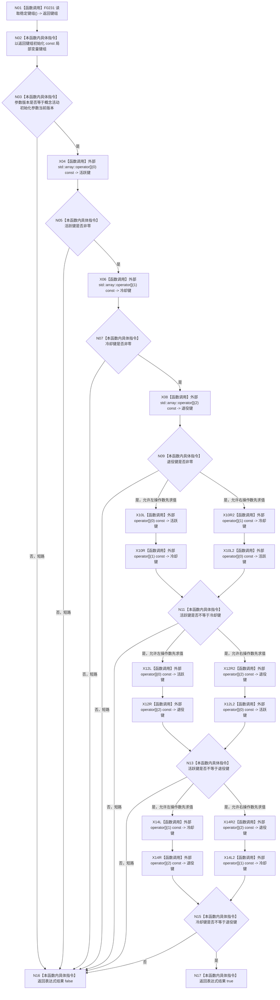

# CF-L5-0108 `概念活动初始化参数::有效` 现状流程图

图类型：现状流程图
代码版本：`a48a70b2d678dea64dd8228adb4f26f0badd9506`
覆盖文件：`海中鱼巣/领域/概念活动状态.数据.h:45-50`
唯一根函数：F0229
完整签名：`bool 海中鱼巣::概念活动初始化参数::有效() const noexcept`
参数：无显式参数；隐式 `this` 是函数调用期间有效的 `const 海中鱼巣::概念活动初始化参数*`
返回结果：`bool`；参数版本等于当前版本、三个稳定主键均非零且两两不同时返回 `true`，否则按 `&&` 短路返回 `false`
调用图：`流程图/代码流程图/00_调用知识图谱.md`
逐行映射表：`流程图/代码流程图/L5/CF-L5-0108_概念活动初始化参数有效_逐行代码映射表.md`
输入契约 / 调用语境表：已按 `0600` 第 9 节核对只读输入、版本及三个生命周期稳定键；`4010` 与 `7140` 提供正式依据
非成功返回二分审查表：`false` 表示初始化参数在写入前未通过版本、非零或互异前置，不产生半结构
偏差清单：`流程图/代码流程图/00_规范偏差审计.md` 的 F0229 逐函数逐节点记录
依据提交 / 结构化消息：冻结代码提交 `a48a70b2d678dea64dd8228adb4f26f0badd9506`
验证输出：本切片只做 Markdown、Mermaid、逐行覆盖和冻结代码对照；全包验证由顶层任务统一执行
不得作为施工许可：是
不得宣称：不得据此宣称当前实现符合待发布规范、偏差已经裁决或代码已经修改

## 函数合同

本函数只读当前对象的参数版本与三个稳定主键，不改变节点、主信息、关系、索引、特征、状态、动态、因果、需求、任务或方法。F0231 返回三个稳定主键组成的值数组；根函数随后按照源码中 `&&` 的从左到右顺序求值，首个不成立的条件立即返回 `false`。

被调函数流程图：

- F0231 `std::array<std::uint64_t, 3> 海中鱼巣::概念活动初始化参数::读取稳定键组() const noexcept`：项目源码函数，待按展开队列生成自己的单函数现状图。
- `std::array<std::uint64_t, 3>::operator const`：标准库外部边界，本函数共调用九次，不生成项目流程图；二元不等比较的两个下标操作数没有可观察副作用，本图不虚构 C++ 未规定的操作数内部求值先后。

## 流程图

## 项目源码调用合同

| 调用节点 | 被调函数 | 参数 / 输入绑定 | 结果 / 输出绑定 | 调用条件与类型 | 被调图 |
| --- | --- | --- | --- | --- | --- |
| N01 | F0231 `std::array<std::uint64_t, 3> 海中鱼巣::概念活动初始化参数::读取稳定键组() const noexcept` | 隐式 `this` 绑定当前 `const 概念活动初始化参数` 对象 | 按值返回结果先记为“返回键组”，再由 N02 初始化 `键组` | 函数进入后无条件；直接 const 成员调用 | 待生成 |

## 外部边界调用

| 节点 | 外部函数 | 参数 / 输入绑定 | 结果 / 输出绑定 | 次数与条件 |
| --- | --- | --- | --- | --- |
| X04/X06/X08/X10*/X12*/X14* | `const std::uint64_t& std::array<std::uint64_t, 3>::operator const` | `this=&键组`；下标依次为 `0`、`1`、`2`、`0/1`、`0/2`、`1/2` | 只读取得参与当前比较的数组元素 | 每次实际执行共九次；三项二元比较分别只选择一条操作数顺序路径 |

## 节点合同

| 节点 | 类型 | 参数 / 输入绑定 | 结果 / 输出绑定 | 事实读写 | 后继条件 |
| --- | --- | --- | --- | --- | --- |
| N01 | 函数调用 | 当前对象 -> F0231 隐式 `this` | `std::array<std::uint64_t, 3>` -> 返回键组 | 只读三个稳定主键 | 调用正常返回 |
| N02 | 本函数内具体指令 | 返回键组 | 初始化 `const auto 键组` | 只写局部值对象 | 初始化完成 |
| N03 | 本函数内具体指令 | `参数版本`、`概念活动初始化参数当前版本` | bool | 只读参数版本 | 是 -> X04；否 -> N16 |
| X04/N05 | 函数调用 / 本函数内具体指令 | `键组[0]` | 活跃键非零条件 | 只读局部数组 | 是 -> X06；否 -> N16 |
| X06/N07 | 函数调用 / 本函数内具体指令 | `键组[1]` | 冷却键非零条件 | 只读局部数组 | 是 -> X08；否 -> N16 |
| X08/N09 | 函数调用 / 本函数内具体指令 | `键组[2]` | 退役键非零条件 | 只读局部数组 | 是 -> X10；否 -> N16 |
| X10*/N11 | 函数调用 / 本函数内具体指令 | `键组[0]`、`键组[1]` | 两键不等条件 | 只读局部数组；两条边表达标准允许的两种求值先后 | 是 -> X12*；否 -> N16 |
| X12*/N13 | 函数调用 / 本函数内具体指令 | `键组[0]`、`键组[2]` | 两键不等条件 | 只读局部数组；两条边表达标准允许的两种求值先后 | 是 -> X14*；否 -> N16 |
| X14*/N15 | 函数调用 / 本函数内具体指令 | `键组[1]`、`键组[2]` | 两键不等条件 | 只读局部数组；两条边表达标准允许的两种求值先后 | 是 -> N17；否 -> N16 |
| N16 | 本函数内具体指令 | 首个不成立的短路条件 | `false` | 无结构变化 | 函数返回 |
| N17 | 本函数内具体指令 | 七个条件全部成立 | `true` | 无结构变化 | 函数返回 |

## 当前证据边界

- 项目源码调用边只有 `F0229 -> F0231` 一条，定义调用点是 `概念活动状态.数据.h:46`。
- 标准库下标访问只登记为外部边界，不进入项目函数清单或待展开队列。
- 当前代码没有写机器结构，也没有未解析调用。
- `false` 分支均为初始化前参数无效结果；三个固定生命周期身份必须非零且互异，与 `4010`、`7140` 一致。
