# CF-L5-0109 `系统角色初始化参数::读取稳定键组` 现状流程图

图类型：现状流程图
代码版本：`a48a70b2d678dea64dd8228adb4f26f0badd9506`
覆盖文件：`海中鱼巣/领域/系统角色清单.数据.h:80-90`
唯一根函数：F0230
归属模块 / 文件 / 层级：头文件内联值投影 / `海中鱼巣/领域/系统角色清单.数据.h` / L5
完整签名：`std::array<std::uint64_t, 21> 海中鱼巣::系统角色初始化参数::读取稳定键组() const noexcept`
源码声明拼写：`std::array<std::uint64_t, 系统角色稳定键数量> 读取稳定键组() const noexcept`，其中 `系统角色稳定键数量 == 21`
参数：无显式参数；隐式 `this` 为 `const 海中鱼巣::系统角色初始化参数*` 的非拥有借用，调用期间必须指向有效对象
返回结果：按固定字段顺序复制 21 个稳定主键形成的 `std::array<std::uint64_t, 21>` 值；无失败分支
调用方：F0071、F0227 及调用知识图谱登记的其它调用点
被调函数：无
调用图：`流程图/代码流程图/00_调用知识图谱.md` 与 `00_调用知识图谱.json`（本批次由顶层任务统一登记）
逐行映射表：`流程图/代码流程图/L5/CF-L5-0109_系统角色初始化参数读取稳定键组_逐行代码映射表.md`
入口前置：隐式 `this` 有效；函数不检查字段是否为零或互异，只复制当前值
结构读取与写入：只读 21 个 `std::uint64_t` 成员；不修改节点、关系、索引或其它机器结构
逻辑内返回：无
内部错误：无代码分支；对象生命周期无效属于调用方违反 C++ 前置条件，不由本函数结构化返回
生命周期与资源释放：返回数组为独立值；不持有源对象引用；全部元素为标量，无显式资源释放
输入契约 / 调用语境表：本图冻结 const 借用和只读值投影事实；调用方契约由聚合图谱逐项绑定
非成功返回二分审查表：不适用，本函数没有非成功返回
偏差清单：由 `流程图/代码流程图/00_规范偏差审计.md` 在覆盖完成后依照 0600 逐节点核规；本图不单独裁决偏差
依据：`规范/0600_代码函数流程图应用与维护规范.md`；冻结提交中的 `海中鱼巣/领域/系统角色清单.数据.h:11,51-90`
验证输出：待顶层任务统一执行图谱端点、Markdown、严格规范检查与 Git 差异检查
不得作为施工许可：是
不得宣称：不得据此宣称调用方契约均成立、字段值有效、代码已修改、构建或运行已经验证、图谱已经闭合

```mermaid
flowchart TD
    S["S【本函数内具体指令】绑定只读 this 并建立按值返回对象"] --> N00["N00【本函数内具体指令】开始直接列表初始化返回数组"]
    N00 --> N01["N01【本函数内具体指令】元素 0 = 世界根主键"]
    N01 --> N02["N02【本函数内具体指令】元素 1 = 自我场景主键"]
    N02 --> N03["N03【本函数内具体指令】元素 2 = 自我存在主键"]
    N03 --> N04["N04【本函数内具体指令】元素 3 = 安全特征定义主键"]
    N04 --> N05["N05【本函数内具体指令】元素 4 = 安全实例槽位主键"]
    N05 --> N06["N06【本函数内具体指令】元素 5 = 安全当前特征值主键"]
    N06 --> N07["N07【本函数内具体指令】元素 6 = 安全目标状态主键"]
    N07 --> N08["N08【本函数内具体指令】元素 7 = 安全根需求主键"]
    N08 --> N09["N09【本函数内具体指令】元素 8 = 服务特征定义主键"]
    N09 --> N10["N10【本函数内具体指令】元素 9 = 服务实例槽位主键"]
    N10 --> N11["N11【本函数内具体指令】元素 10 = 服务当前特征值主键"]
    N11 --> N12["N12【本函数内具体指令】元素 11 = 服务目标状态主键"]
    N12 --> N13["N13【本函数内具体指令】元素 12 = 服务根需求主键"]
    N13 --> N14["N14【本函数内具体指令】元素 13 = 概念存在根主键"]
    N14 --> N15["N15【本函数内具体指令】元素 14 = 概念动态根主键"]
    N15 --> N16["N16【本函数内具体指令】元素 15 = 概念关系根主键"]
    N16 --> N17["N17【本函数内具体指令】元素 16 = 概念因果根主键"]
    N17 --> N18["N18【本函数内具体指令】元素 17 = 方法登记根主键"]
    N18 --> N19["N19【本函数内具体指令】元素 18 = 方法登记角色状态主键"]
    N19 --> N20["N20【本函数内具体指令】元素 19 = 方法活跃状态主键"]
    N20 --> N21["N21【本函数内具体指令】元素 20 = 方法失效状态主键"]
    N21 --> N22["N22【本函数内具体指令】完成 21 元素 std::array 聚合初始化"]
    N22 --> R["R【本函数内具体指令】按值返回稳定键组"]
```



## 节点合同

| 节点 | 类型 | 参数 / 输入绑定 | 结果 / 输出绑定 | 事实读写 | 后继条件 | 验证 |
| --- | --- | --- | --- | --- | --- | --- |
| S | 本函数内具体指令 | 有效只读 `this`、按值返回存储 | 绑定输入并建立返回对象 | 只形成返回值对象 | 无条件进入 N00 | 对照 80-81 行 |
| N00 | 本函数内具体指令 | 返回类型 `std::array<std::uint64_t,21>` | 启动直接列表初始化 | 无 | 无条件进入 N01 | 对照 81 行 |
| N01 | 本函数内具体指令 | `this->世界根主键` | 数组元素 0 | 只读成员 | 无条件进入 N02 | 对照 82 行 |
| N02 | 本函数内具体指令 | `this->自我场景主键` | 数组元素 1 | 只读成员 | 无条件进入 N03 | 对照 82 行 |
| N03 | 本函数内具体指令 | `this->自我存在主键` | 数组元素 2 | 只读成员 | 无条件进入 N04 | 对照 82 行 |
| N04 | 本函数内具体指令 | `this->安全特征定义主键` | 数组元素 3 | 只读成员 | 无条件进入 N05 | 对照 83 行 |
| N05 | 本函数内具体指令 | `this->安全实例槽位主键` | 数组元素 4 | 只读成员 | 无条件进入 N06 | 对照 83 行 |
| N06 | 本函数内具体指令 | `this->安全当前特征值主键` | 数组元素 5 | 只读成员 | 无条件进入 N07 | 对照 83 行 |
| N07 | 本函数内具体指令 | `this->安全目标状态主键` | 数组元素 6 | 只读成员 | 无条件进入 N08 | 对照 84 行 |
| N08 | 本函数内具体指令 | `this->安全根需求主键` | 数组元素 7 | 只读成员 | 无条件进入 N09 | 对照 84 行 |
| N09 | 本函数内具体指令 | `this->服务特征定义主键` | 数组元素 8 | 只读成员 | 无条件进入 N10 | 对照 85 行 |
| N10 | 本函数内具体指令 | `this->服务实例槽位主键` | 数组元素 9 | 只读成员 | 无条件进入 N11 | 对照 85 行 |
| N11 | 本函数内具体指令 | `this->服务当前特征值主键` | 数组元素 10 | 只读成员 | 无条件进入 N12 | 对照 85 行 |
| N12 | 本函数内具体指令 | `this->服务目标状态主键` | 数组元素 11 | 只读成员 | 无条件进入 N13 | 对照 86 行 |
| N13 | 本函数内具体指令 | `this->服务根需求主键` | 数组元素 12 | 只读成员 | 无条件进入 N14 | 对照 86 行 |
| N14 | 本函数内具体指令 | `this->概念存在根主键` | 数组元素 13 | 只读成员 | 无条件进入 N15 | 对照 87 行 |
| N15 | 本函数内具体指令 | `this->概念动态根主键` | 数组元素 14 | 只读成员 | 无条件进入 N16 | 对照 87 行 |
| N16 | 本函数内具体指令 | `this->概念关系根主键` | 数组元素 15 | 只读成员 | 无条件进入 N17 | 对照 87 行 |
| N17 | 本函数内具体指令 | `this->概念因果根主键` | 数组元素 16 | 只读成员 | 无条件进入 N18 | 对照 88 行 |
| N18 | 本函数内具体指令 | `this->方法登记根主键` | 数组元素 17 | 只读成员 | 无条件进入 N19 | 对照 88 行 |
| N19 | 本函数内具体指令 | `this->方法登记角色状态主键` | 数组元素 18 | 只读成员 | 无条件进入 N20 | 对照 88 行 |
| N20 | 本函数内具体指令 | `this->方法活跃状态主键` | 数组元素 19 | 只读成员 | 无条件进入 N21 | 对照 89 行 |
| N21 | 本函数内具体指令 | `this->方法失效状态主键` | 数组元素 20 | 只读成员 | 无条件进入 N22 | 对照 89 行 |
| N22 | 本函数内具体指令 | 已初始化的 21 个标量元素 | 完整返回数组值 | 只写新建返回值，不写源对象或仓库 | 无条件进入 R | 对照 81-89 行 |
| R | 本函数内具体指令 | 完整返回数组值 | `std::array<std::uint64_t,21>` | 所有权随值返回调用方 | 函数返回 | 对照 81-90 行 |

## 关键边界

```text
1. 系统角色稳定键数量在同一头文件第 11 行固定为 21，返回类型和初始化元素数一致。
2. 花括号初始化列表的 21 个初始化子句按源码顺序求值；字段到数组下标的映射固定为 0—20。
3. 本函数只复制稳定主键，不读取清单版本和值字段，也不判断零值、重复值、类型、句柄或关系完整性。
4. 聚合初始化不是另一个项目源码函数调用；标量复制和 std::array 聚合构造均作为本函数内具体指令记录。
5. 返回数组拥有独立值生命周期，不保留指向 系统角色初始化参数 的引用。
6. 本函数无项目调用、外部边界调用、未解析调用、递归、循环、分支或非成功返回。
```
