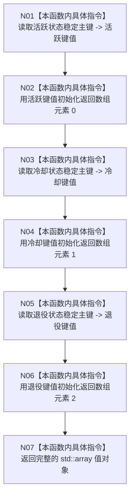

# CF-L5-0110 `概念活动初始化参数::读取稳定键组` 现状流程图

图类型：现状流程图
代码版本：`a48a70b2d678dea64dd8228adb4f26f0badd9506`
覆盖文件：`海中鱼巣/领域/概念活动状态.数据.h:41-43`
唯一根函数：F0231
完整签名：`std::array<std::uint64_t, 3> 海中鱼巣::概念活动初始化参数::读取稳定键组() const noexcept`
参数：无显式参数；隐式 `this` 为 `const 概念活动初始化参数*`，只读借用至函数返回
返回结果：按活跃、冷却、退役顺序聚合初始化的 `std::array<std::uint64_t, 3>` 值对象
调用方：F0071 `海中鱼巣::生产运行期配置::有效()`；F0229 `海中鱼巣::概念活动初始化参数::有效()`
被调函数：无
调用图：`流程图/代码流程图/00_调用知识图谱.md`
逐行映射表：`流程图/代码流程图/L5/CF-L5-0110_概念活动初始化参数读取稳定键组_逐行代码映射表.md`
入口前置：当前代码没有显式前置判断；函数只读取当前对象的三个 `std::uint64_t` 成员
结构读取与写入：读取三个稳定主键成员；不写节点、主信息、关系、索引、特征、状态、动态、因果、需求、任务或方法
逻辑内返回：无分支；总是返回三个当前成员值组成的数组
内部错误：当前函数体无内部错误分支
生命周期与资源释放：隐式 `this` 只在调用期间借用；返回数组按值离开函数，无动态资源
验证入口：冻结源码逐行映射与 Mermaid 节点机械核对；未运行代码构建或程序
依据：`规范/0600_代码函数流程图应用与维护规范.md`；冻结代码提交 `a48a70b2d678dea64dd8228adb4f26f0badd9506`
不得作为施工许可：是
不得宣称：本图不证明调用方参数有效，不证明返回键非零或互异，也不证明构建、运行或业务能力已验收

## 流程图

## 节点合同

| 节点 | 类型 | 参数 / 输入绑定 | 结果 / 输出绑定 | 当前代码事实 | 后继 |
| --- | --- | --- | --- | --- | --- |
| N01 | 本函数内具体指令 | `this->活跃状态稳定主键` | 当前成员值 -> 活跃键值 | 对第一个聚合初始化子句执行左值到右值读取 | N02 |
| N02 | 本函数内具体指令 | 活跃键值 | 返回数组元素 `0` | 初始化第一个 `std::uint64_t` 元素 | N03 |
| N03 | 本函数内具体指令 | `this->冷却状态稳定主键` | 当前成员值 -> 冷却键值 | 第一个初始化子句完成后读取第二个成员 | N04 |
| N04 | 本函数内具体指令 | 冷却键值 | 返回数组元素 `1` | 初始化第二个 `std::uint64_t` 元素 | N05 |
| N05 | 本函数内具体指令 | `this->退役状态稳定主键` | 当前成员值 -> 退役键值 | 第二个初始化子句完成后读取第三个成员 | N06 |
| N06 | 本函数内具体指令 | 退役键值 | 返回数组元素 `2` | 初始化第三个 `std::uint64_t` 元素 | N07 |
| N07 | 本函数内具体指令 | 三个已初始化元素 | `std::array<std::uint64_t, 3>` | 返回按花括号初始化列表顺序形成的值对象 | 函数返回 |

## 当前事实边界

- 花括号初始化列表的三个初始化子句按源码顺序求值：活跃键、冷却键、退役键。
- `std::array<std::uint64_t, 3>` 在此处是聚合初始化；当前表达式没有调用用户定义构造函数。
- 项目源码调用边为零，外部边界调用为零，未解析调用为零。
- 本函数不检查零值、重复值或参数版本；这些行为不属于 F0231 当前函数体。
