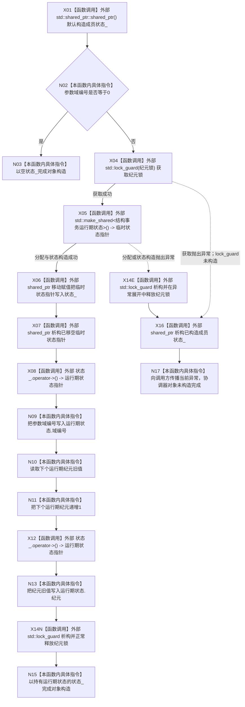

# CF-L5-0111 `结构事务协调器::结构事务协调器` 现状流程图

图类型：现状流程图
代码版本：`a48a70b2d678dea64dd8228adb4f26f0badd9506`
覆盖文件：`海中鱼巣/核心/协调.结构事务.ixx:137-145`；成员声明顺序证据：同文件 `164`
唯一根函数：F0232
完整签名：`海中鱼巣::结构事务协调器::结构事务协调器(std::uint64_t 域编号)`
参数：`域编号`，按值传入的 `std::uint64_t`；函数调用期间有效，不转移所有权
返回结果：无显式返回值；成功时构造一个协调器对象。`域编号 == 0` 时对象成功构造但 `状态_` 为空；非零时 `状态_` 持有新建运行期状态。标准库锁获取或状态分配 / 构造异常时构造失败并向调用方传播异常
调用图：`流程图/代码流程图/00_调用知识图谱.md`
逐行映射表：`流程图/代码流程图/L5/CF-L5-0111_结构事务协调器构造_逐行代码映射表.md`
输入契约 / 调用语境表：本图冻结当前代码事实；调用方输入保证与正式语义按 `0600` 第 9 节在偏差审计中核对
非成功返回二分审查表：构造异常是外部边界异常传播；零域正常构造为空状态的规范允许性在偏差审计中具名裁决
偏差清单：`流程图/代码流程图/00_规范偏差审计.md` 的 F0232 逐函数逐节点记录
依据提交 / 结构化消息：冻结代码提交 `a48a70b2d678dea64dd8228adb4f26f0badd9506`；正式工程治理规范 `规范/0600_代码函数流程图应用与维护规范.md`
验证输出：本切片只执行 Markdown、Mermaid、逐行覆盖与冻结代码对照；全包验证由顶层任务统一执行
不得作为施工许可：是
不得宣称：不得据此宣称当前构造合同符合全部正式规范、异常路径已经运行验证或代码已经修改

## 函数合同与初始化顺序

源码没有显式成员初始化列表。进入构造函数体前，唯一成员 `状态_` 按声明顺序调用 `std::shared_ptr` 默认构造函数，形成空共享指针。

非零域路径在 `结构事务内部::纪元锁` 的 `std::lock_guard` 生命周期内：

1. `std::make_shared` 分配并默认构造 `结构事务运行期状态`；
2. 把新共享指针移入 `状态_`；
3. 写入域编号；
4. 读取 `下个运行期纪元` 的旧值、递增全局计数，并把旧值写入状态纪元；
5. 退出作用域时释放纪元锁。

`结构事务运行期状态` 没有显式项目源码构造函数；其隐式默认构造由 `std::make_shared` 触发，按成员声明与默认成员初始化器形成 `域编号=0`、`纪元=0`、`下个许可序号=1`、两个互斥量、空活动表和 `已隔离=false`。该隐式编译器 / 标准库边界不加入项目函数待展开队列。

## 流程图

## 项目源码调用合同

本函数没有直接项目源码函数调用，不新增项目调用边或待展开函数。`结构事务运行期状态` 的构造函数由编译器隐式生成，不是本次冻结代码中可独立定位的项目源码函数定义。

## 外部边界调用

| 节点 | 外部函数 / 边界 | 参数 / 输入绑定 | 结果 / 输出绑定 | 正常与异常影响 |
| --- | --- | --- | --- | --- |
| X01 | `std::shared_ptr<结构事务运行期状态>::shared_ptr()` | 隐式成员 `状态_` | 空共享指针 | 无抛出；先于函数体完成 |
| X04 | `std::lock_guard<std::mutex>::lock_guard(std::mutex&)`，内部调用 `std::mutex::lock()` | `结构事务内部::纪元锁` | 已持锁的局部 `锁` | 获取失败可抛出；此时 `锁` 未构造 |
| X05 | `std::make_shared<结构事务运行期状态>()` | 无显式实参 | 临时 `shared_ptr` | 分配或隐式状态构造可抛出；成功时状态按默认成员初始化器形成 |
| X06 | `std::shared_ptr<结构事务运行期状态>::operator=(std::shared_ptr&&)` | `状态_`、临时状态指针 | `状态_` 取得唯一当前共享所有权；临时指针移空 | 移动赋值不抛出 |
| X07/X16 | `std::shared_ptr<结构事务运行期状态>::~shared_ptr()` | 已移空临时指针；或构造失败时已构造的成员 `状态_` | 释放各自持有资源 | X16 只在构造异常展开时执行 |
| X08/X12 | `std::shared_ptr<结构事务运行期状态>::operator->() const noexcept` | `状态_` | 非空运行期状态裸指针 | 各调用一次；只在 X05/X06 成功后执行 |
| X14N/X14E | `std::lock_guard<std::mutex>::~lock_guard()`，内部调用 `std::mutex::unlock()` | 局部 `锁` | 释放 `纪元锁` | 同一词法析构点按正常离开与 X05 异常展开分别制图 |

## 节点合同

| 节点 | 类型 | 参数 / 输入绑定 | 结果 / 输出绑定 | 事实读写 | 后继条件 |
| --- | --- | --- | --- | --- | --- |
| X01 | 函数调用 | 成员 `状态_` 的存储 | 空 `状态_` | 只形成对象资源成员 | 完成 -> N02 |
| N02 | 本函数内具体指令 | 参数 `域编号` | bool | 只读参数 | 零 -> N03；非零 -> X04 |
| N03 | 本函数内具体指令 | 空 `状态_` | 构造成功 | 不建立运行期状态 | 函数结束 |
| X04 | 函数调用 | 全局 `纪元锁` | 已持锁的 RAII 对象 | 取得同步资源 | 成功 -> X05；异常 -> X16 |
| X05 | 函数调用 | 状态类型及其默认成员初始化器 | 临时共享指针 | 新建运行期状态对象 | 成功 -> X06；异常 -> X14E |
| X06 | 函数调用 | 临时共享指针 | `状态_` 持有状态，临时指针移空 | 改变资源所有权 | 完成 -> X07 |
| X07 | 函数调用 | 已移空临时共享指针 | 临时生命周期结束 | 无机器结构变化 | 完成 -> X08 |
| X08/N09 | 函数调用 / 本函数内具体指令 | `状态_`、参数 `域编号` | `运行期状态.域编号=域编号` | 写新状态的域编号 | 完成 -> N10 |
| N10 | 本函数内具体指令 | `下个运行期纪元` | 纪元旧值 | 只读全局计数 | 完成 -> N11 |
| N11 | 本函数内具体指令 | `下个运行期纪元` | 原值加一 | 写全局计数 | 完成 -> X12 |
| X12/N13 | 函数调用 / 本函数内具体指令 | `状态_`、纪元旧值 | `运行期状态.纪元=旧值` | 写新状态的纪元 | 完成 -> X14N |
| X14N | 函数调用 | 正常路径已持锁的 `锁` | 纪元锁释放 | 释放同步资源 | N15 |
| X14E | 函数调用 | 异常展开路径已持锁的 `锁` | 纪元锁释放 | 释放同步资源 | X16 |
| N15 | 本函数内具体指令 | 非空 `状态_` | 构造成功 | 协调器保留共享状态所有权 | 函数结束 |
| X16 | 函数调用 | 已构造成员 `状态_` | 成员资源清理 | 构造失败，不留下协调器对象 | 完成 -> N17 |
| N17 | 本函数内具体指令 | X04 或 X05 的当前异常 | 异常传播 | 无协调器对象发布 | 退出构造 |

## 当前证据边界

- 项目源码调用边：0；未解析调用：0。
- `域编号 == 0` 是正常构造完成路径，而不是 C++ 构造失败；F0233 必须继续证明空协调器不会发布零域事务身份。
- 全局纪元读取、递增和状态纪元写入发生在同一纪元锁生命周期内；本图只记录实现顺序，不据此宣称跨进程唯一性或溢出处理存在。
- 只有 X04 和 X05 具有本函数可见的异常传播边界；后续共享指针移动、解引用及标量写入按当前类型合同不抛出。
- 本图不把编译器隐式构造函数登记成项目源码函数，也不为标准库边界生成内部流程图。
