# CF-L5-0112 `结构事务协调器::生成接线` 现状流程图

图类型：现状流程图
代码版本：`a48a70b2d678dea64dd8228adb4f26f0badd9506`
覆盖文件：`海中鱼巣/核心/协调.结构事务.ixx:147-157`
唯一根函数：F0233
归属模块 / 文件 / 层级：`海中鱼巣.核心.协调.结构事务` / `海中鱼巣/核心/协调.结构事务.ixx` / L5
完整签名：`海中鱼巣::结构事务接线 海中鱼巣::结构事务协调器::生成接线()`
参数：无显式参数；隐式 `this` 为可变 `结构事务协调器*` 的非拥有借用，函数只读成员 `状态_`
返回结果：`状态_` 为空时返回完全未接域的值初始化接线；非空时返回携带域、纪元、共享运行期状态及五个回调函数指针的接线
调用方：F0072 及调用知识图谱登记的生产 / 自检调用点
本次立即执行的项目被调函数：无
延迟回调项目实体：行 152—156 的五个具名 lambda；当前函数清单均无身份，须由顶层图谱以冻结提交、文件、完整签名和定义行分别登记
调用图：`流程图/代码流程图/00_调用知识图谱.md` 与 `00_调用知识图谱.json`（函数、绑定边及延迟回调边由顶层任务统一登记）
逐行映射表：`流程图/代码流程图/L5/CF-L5-0112_结构事务协调器生成接线_逐行代码映射表.md`
入口前置：隐式 `this` 有效；函数允许 `状态_` 为空
结构读取与写入：只读 `状态_`、运行期状态的域编号和纪元；构造返回值并复制共享所有权，不修改运行期状态
逻辑内返回：`状态_` 为空时返回完全未接域接线
内部错误：无显式分支；共享指针复制可能按标准库分配 / 引用计数机制抛出异常，本函数未捕获
生命周期与资源释放：非空接线通过 `shared_ptr<void>` 延长同一运行期状态生命周期；五个无捕获 lambda 转换后的函数指针不依赖临时闭包寿命
输入契约 / 调用语境表：调用方取得值式接线后可以保存并延迟调用回调；本函数不验证下游是否替换公开函数指针字段
非成功返回二分审查表：空状态分支的正式分类按当前代码为允许的未接域返回；整体规范核对由覆盖完成后的审计统一完成
偏差清单：由 `流程图/代码流程图/00_规范偏差审计.md` 在覆盖完成后依照 0600 逐节点核规；本图不单独形成施工裁决
依据：`规范/0600_代码函数流程图应用与维护规范.md`；冻结提交中的 `海中鱼巣/核心/协调.结构事务.ixx:147-157` 与 `海中鱼巣/核心/结构事务接线.数据.h:62-72`
验证输出：待顶层任务统一执行身份、绑定边、Markdown、严格规范检查与 Git 差异检查
不得作为施工许可：是
不得宣称：不得据此宣称任一延迟回调已执行、许可已取得、令牌已验证、运行期状态是业务事实、构建或运行已经验证、图谱已经闭合

```mermaid
flowchart TD
    S["S【本函数内具体指令】绑定隐式 this 并只读借用状态_"] --> N01{"N01【本函数内具体指令】状态_ 是否为空"}
    N01 -- 是 --> N02["N02【本函数内具体指令】开始值初始化空结构事务接线"]
    N02 --> N03["N03【本函数内具体指令】空接线.域编号 = 0"]
    N03 --> N04["N04【本函数内具体指令】空接线.运行期纪元 = 0"]
    N04 --> X05["X05【函数调用】外部 std::shared_ptr&lt;void&gt; 默认构造 -> 空接线.运行期状态"]
    X05 --> N06["N06【本函数内具体指令】空接线.取得共享许可 = nullptr"]
    N06 --> N07["N07【本函数内具体指令】空接线.取得独占许可 = nullptr"]
    N07 --> N08["N08【本函数内具体指令】空接线.验证共享路径令牌 = nullptr"]
    N08 --> N09["N09【本函数内具体指令】空接线.验证独占令牌 = nullptr"]
    N09 --> N10["N10【本函数内具体指令】空接线.标记撤销失败隔离 = nullptr"]
    N10 --> R0["R0【本函数内具体指令】返回完全未接域接线"]

    N01 -- 否 --> N11["N11【本函数内具体指令】开始按初始化列表构造已接域接线"]
    N11 --> N12["N12【本函数内具体指令】接线.域编号 = 状态_->域编号"]
    N12 --> N13["N13【本函数内具体指令】接线.运行期纪元 = 状态_->纪元"]
    N13 --> X14["X14【函数调用】外部 std::shared_ptr&lt;void&gt; 转换复制构造(状态_) -> 接线.运行期状态"]

    X14 --> N15["N15【本函数内具体指令】构造行152无捕获共享许可lambda，捕获集为空"]
    N15 --> X16["X16【函数调用】编译器生成lambda转换 -> 共享许可函数指针"]
    X16 --> N17["N17【本函数内具体指令】接线.取得共享许可 = 共享许可函数指针"]

    N17 --> N18["N18【本函数内具体指令】构造行153无捕获独占许可lambda，捕获集为空"]
    N18 --> X19["X19【函数调用】编译器生成lambda转换 -> 独占许可函数指针"]
    X19 --> N20["N20【本函数内具体指令】接线.取得独占许可 = 独占许可函数指针"]

    N20 --> N21["N21【本函数内具体指令】构造行154无捕获共享路径验证lambda，捕获集为空"]
    N21 --> X22["X22【函数调用】编译器生成lambda转换 -> 共享路径验证函数指针"]
    X22 --> N23["N23【本函数内具体指令】接线.验证共享路径令牌 = 共享路径验证函数指针"]

    N23 --> N24["N24【本函数内具体指令】构造行155无捕获独占验证lambda，捕获集为空"]
    N24 --> X25["X25【函数调用】编译器生成lambda转换 -> 独占验证函数指针"]
    X25 --> N26["N26【本函数内具体指令】接线.验证独占令牌 = 独占验证函数指针"]

    N26 --> N27["N27【本函数内具体指令】构造行156无捕获撤销失败隔离lambda，捕获集为空"]
    N27 --> X28["X28【函数调用】编译器生成lambda转换 -> 撤销失败隔离函数指针"]
    X28 --> N29["N29【本函数内具体指令】接线.标记撤销失败隔离 = 撤销失败隔离函数指针"]

    N29 --> N30["N30【本函数内具体指令】完成八成员结构事务接线聚合初始化"]
    N30 --> R1["R1【本函数内具体指令】按值返回已接域接线"]
```



## 节点合同

| 节点 | 类型 | 参数 / 输入绑定 | 结果 / 输出绑定 | 事实读写 | 后继条件 | 验证 |
| --- | --- | --- | --- | --- | --- | --- |
| N01 | 本函数内具体指令 | `this->状态_` | 空 / 非空分支 | 只读 shared_ptr | 空进入 N02；非空进入 N11 | 对照 148 行 |
| N02-N04 | 本函数内具体指令 | `return {}` 与前两个默认成员初始化器 | 空接线的域编号、纪元 | 只构造返回值 | 顺序进入 X05 | 对照 149 行和接线数据头 |
| X05 | 函数调用 | 无 | 空 `shared_ptr<void>` | 只构造返回成员 | 进入 N06 | 标准库默认构造 |
| N06-N10 | 本函数内具体指令 | 五个函数指针默认成员初始化器 | 五个 `nullptr` 字段 | 只构造返回值 | 顺序进入 R0 | 对照接线数据头 66-70 行 |
| R0 | 本函数内具体指令 | 完全未接域接线 | 返回 `结构事务接线` | 所有权随值返回 | 函数结束 | 对照 149-150 行 |
| N11 | 本函数内具体指令 | 第 151-156 行初始化列表 | 开始已接域聚合初始化 | 只构造返回值 | 进入 N12 | 对照 151 行 |
| N12 | 本函数内具体指令 | `状态_->域编号` | `接线.域编号` | 只读运行期状态 | 进入 N13 | 对照 151 行 |
| N13 | 本函数内具体指令 | `状态_->纪元` | `接线.运行期纪元` | 只读运行期状态 | 进入 X14 | 对照 151 行 |
| X14 | 函数调用 | `状态_ : shared_ptr<结构事务运行期状态>` | `接线.运行期状态 : shared_ptr<void>` | 增加同一控制块强引用，不深拷贝状态 | 进入 N15 | 标准库转换复制构造 |
| N15 / N18 / N21 / N24 / N27 | 本函数内具体指令 | 对应源码 lambda 表达式 `[]` | 五个空捕获闭包临时值 | 无状态捕获，不读取协调器成员 | 各自进入对应转换节点 | 对照 152-156 行 |
| X16 / X19 / X22 / X25 / X28 | 函数调用 | 对应无捕获闭包临时值 | 精确类型函数指针 | 编译器生成转换；不执行 lambda 正文 | 各自进入对应绑定节点 | 核对函数指针字段类型 |
| N17 | 本函数内具体指令 | 行152函数指针 | `取得共享许可` 字段 | 只写返回值 | 进入 N18 | 绑定 `结构许可类型::共享` 的延迟回调 |
| N20 | 本函数内具体指令 | 行153函数指针 | `取得独占许可` 字段 | 只写返回值 | 进入 N21 | 绑定 `结构许可类型::独占` 的延迟回调 |
| N23 | 本函数内具体指令 | 行154函数指针 | `验证共享路径令牌` 字段 | 只写返回值 | 进入 N24 | 绑定 `需要独占=false` 的延迟回调 |
| N26 | 本函数内具体指令 | 行155函数指针 | `验证独占令牌` 字段 | 只写返回值 | 进入 N27 | 绑定 `需要独占=true` 的延迟回调 |
| N29 | 本函数内具体指令 | 行156函数指针 | `标记撤销失败隔离` 字段 | 只写返回值 | 进入 N30 | 绑定撤销失败隔离延迟回调 |
| N30 | 本函数内具体指令 | 八个已初始化成员 | 完整已接域接线值 | 只完成返回对象 | 进入 R1 | 字段数与数据头一致 |
| R1 | 本函数内具体指令 | 完整已接域接线 | 返回 `结构事务接线` | 返回值保有状态共享所有权 | 函数结束 | 对照 151-157 行 |

## 延迟回调实体与绑定

| 定义位置 | 唯一完整函数身份 | 捕获 | 绑定字段 | 延迟执行正文 | 当前函数清单身份 |
| --- | --- | --- | --- | --- | --- |
| `海中鱼巣/核心/协调.结构事务.ixx:152` | `海中鱼巣::结构事务许可 海中鱼巣::结构事务协调器::生成接线()::<lambda@协调.结构事务.ixx:152>::operator()(const std::shared_ptr<void>& 状态) const` | 无 | `取得共享许可` | 调用 `结构事务内部::取得许可(状态, 结构许可类型::共享)` 并返回 | 无，待顶层登记 |
| 同文件:153 | `海中鱼巣::结构事务许可 海中鱼巣::结构事务协调器::生成接线()::<lambda@协调.结构事务.ixx:153>::operator()(const std::shared_ptr<void>& 状态) const` | 无 | `取得独占许可` | 调用 `结构事务内部::取得许可(状态, 结构许可类型::独占)` 并返回 | 无，待顶层登记 |
| 同文件:154 | `bool 海中鱼巣::结构事务协调器::生成接线()::<lambda@协调.结构事务.ixx:154>::operator()(const std::shared_ptr<void>& 状态, const 海中鱼巣::结构事务令牌& 令牌) const` | 无 | `验证共享路径令牌` | 调用 `结构事务内部::验证令牌(状态, 令牌, false)` 并返回 | 无，待顶层登记 |
| 同文件:155 | `bool 海中鱼巣::结构事务协调器::生成接线()::<lambda@协调.结构事务.ixx:155>::operator()(const std::shared_ptr<void>& 状态, const 海中鱼巣::结构事务令牌& 令牌) const` | 无 | `验证独占令牌` | 调用 `结构事务内部::验证令牌(状态, 令牌, true)` 并返回 | 无，待顶层登记 |
| 同文件:156 | `bool 海中鱼巣::结构事务协调器::生成接线()::<lambda@协调.结构事务.ixx:156>::operator()(const std::shared_ptr<void>& 状态, const 海中鱼巣::结构事务令牌& 令牌) const` | 无 | `标记撤销失败隔离` | 调用 `结构事务内部::标记撤销失败隔离(状态, 令牌)` 并返回 | 无，待顶层登记 |

## 关键边界

```text
1. 状态_ 为空时，八个接线成员按默认成员初始化器形成全空接线；没有构造任何 lambda。
2. 状态_ 非空时，八个聚合初始化子句按源码顺序求值：域、纪元、共享状态、五个回调。
3. shared_ptr 转换复制使返回接线与协调器共享同一运行期状态控制块；不复制锁、活动表或其它状态对象。
4. 五个 lambda 捕获集均为空；它们不捕获 this 或 状态_，运行时状态完全来自函数指针调用参数。
5. 本函数只构造闭包、转换并绑定函数指针；五个 lambda 正文及其内部项目调用在本函数返回前均未执行。
6. 五个 lambda 均有唯一源码位置、完整签名和固定参数语义，应作为五个独立延迟回调项目实体入队；当前清单没有这些身份。
7. 本函数立即执行的项目调用边为零；编译器转换和 shared_ptr 构造是外部边界；未解析调用为零。
```
